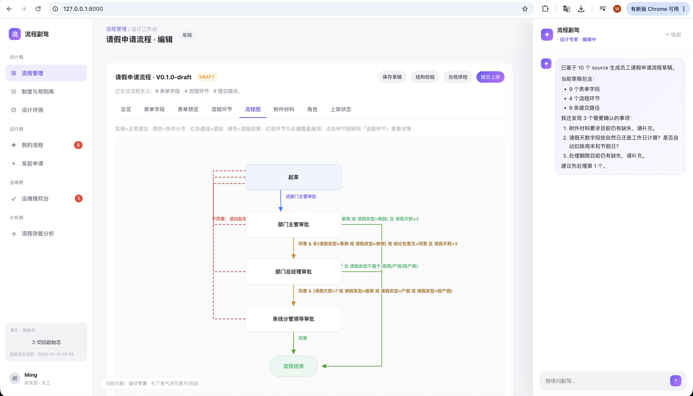
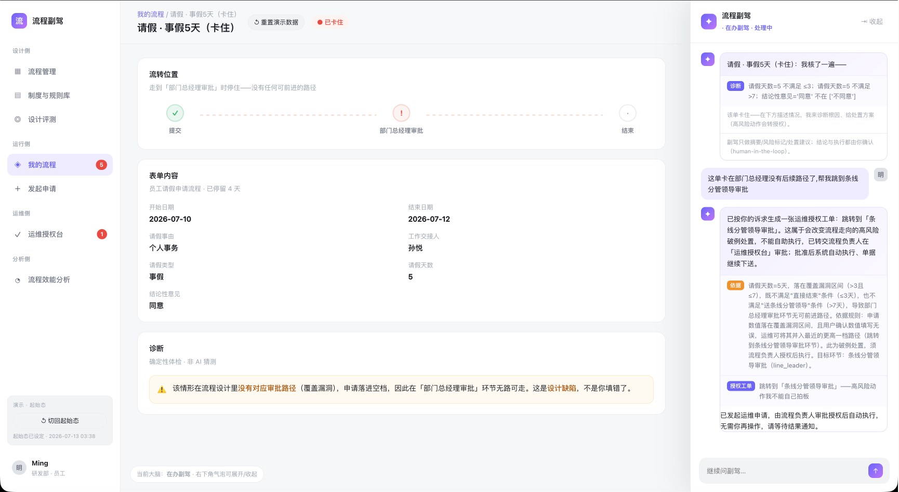
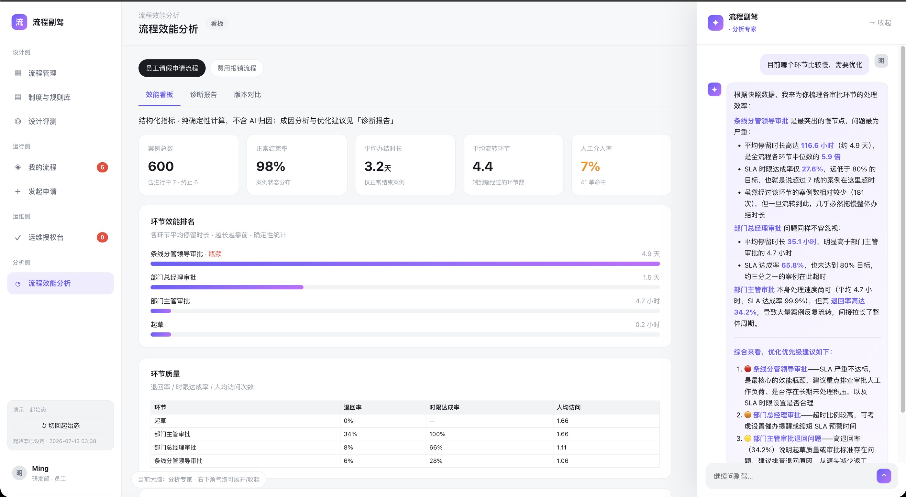

# Process Copilot

**English** · [简体中文](README.zh-CN.md)

> An AI system for the full lifecycle of enterprise workflows: it extracts business processes
> scattered across documents, emails, spreadsheets and group chats into a standardised,
> deployable definition — then feeds runtime data back into design, closing
> **design → run → analyse → feed back** into a loop that improves itself.

One engineering principle runs through all of it: **deterministic things stay deterministic,
the LLM only does what only an LLM can do.** The model handles understanding intent and
phrasing answers; anything with a checkable right answer — validation, metric computation,
path evaluation, scoring, applying edits — is deterministic code. In the design extraction
pipeline, only two of six nodes touch an LLM.

> **About this project**: a personal project, built from scratch, not affiliated with any
> employer. The pain points and scenarios are distilled from real problems I ran into while
> building workflow-digitalisation and efficiency-dashboard products. Every case in this
> repository is synthetic or anonymised sample data — no real institutional information.

**Full product write-up, per-agent breakdown and screenshots**:
<https://mingwen.net/projects/process-copilot.html>

| Design agent: sources → definition | Ops: high-risk actions need sign-off | Analytics: metrics + attribution |
| --- | --- | --- |
|  |  |  |

> Evaluation numbers, design trade-offs and current limits live on the detail page above —
> this README deliberately does not repeat them, **so the two can't drift apart**.
>
> Most of the in-repo design documentation under `doc/` is written in Chinese.

---

## System overview

```
     ┌─────────── Rules knowledge base (RAG) ───────────┐  ← design / analytics / copilots
     │  policies · element specs · ops rules · templates │     all retrieve evidence here
     └──────────────────┬───────────────────────────────┘
                        │ retrieves "applicable rules" as design constraints and evidence
                        │ (also used for reference-free compliance scoring)
  Source material ─▶ ① Design agent ─▶ Process definition (JSON) ─▶ ⑤ Translator ─▶ Lark Approval
                        │            │                                              (real OA engine)
                        │            │  Eval: element-level P/R/F1 vs gold
   conversational ⟲─────┘            │      + compliance hit rate (reference-free)
       editing                       ▼
                          ② Thin runtime (happy path) ─▶ structured run event log
                                     │
                                     ├──────▶ ④ Participant copilots (launch / ops / management)
                                     ▼
                          ③ Analytics agent ─▶ metrics · bottlenecks · diagnosis report
                                     │
                                     └──────▶ suggestions feed back into ① redesign  ⟲ loop closed
```

## The agents

| Agent | For whom | What it does |
| --- | --- | --- |
| **Design** | Process owner | A LangGraph multi-agent pipeline turns multi-source material into a standard definition; edit it conversationally (typed tools + diff + undo + post-edit validation) |
| **Launch guide** | Any employee | Finds the right process, previews the path, required materials and expected duration deterministically from the definition |
| **Todo & in-flight copilot** | Approvers / initiators | Urgency ranking, per-document compliance check, explains a case's current state; every deterministic action goes through a confirmation gate |
| **Ops** | Initiators / approvers / admins | Deterministic diagnosis of a stuck case; applies directly when policy allows, otherwise escalates into an authorisation ticket |
| **Analytics** | Owners / platform admins | Computes metrics deterministically, judges bottlenecks against thresholds, attributes causes with an LLM, feeds findings back to management |
| **Management** | Owners / system admins | Global view and design entry point; diagnoses and fixes fed-back items one by one; publish / unpublish |
| Design evaluation | (harness tuning) | AI reverse-generates raw sources, humans lock the gold; field-level P/R/F1 plus an LLM judge for synonym equivalence |
| Rules RAG | Shared layer | Atomic rules + two-stage hybrid retrieval — maintained once, reused in three places, every hit traceable to its source clause |

**The loop closes**: after one process went through *runtime diagnosis → feed back → redesign (v2)*,
recomputing over the synthetic event log gives average cycle time 76h → 23h and conformance
violations 7 → 0.

> ⚠️ This is a **what-if process simulation**. The pipeline and the metric computation are real,
> and the structural improvement (skip-level violations going to zero once a fallback path exists)
> holds mechanically — but **the magnitude comes from modelling assumptions, not a validated
> business ROI**: the runtime is a demo mock and the event log is synthetic.

## Permission boundaries

Written in code, not in prompts:

- **Read-only** — the SQL escape hatch is parsed with sqlglot: single `SELECT` only, `ATTACH` /
  `PRAGMA` / DDL / DML explicitly blocked, row cap and statement timeout enforced. The main path
  doesn't use SQL at all; it uses typed queries that can only filter, aggregate and optionally group.
- **Writes are typed operations** — 21 typed edit operations, not free-form JSON editing.
  Each is applied and validated one at a time, with diff and undo.
- **Initiator confirmation** — fixing your own field values, withdrawing your own case.
- **Owner authorisation** — jumping to a node, skipping a node, reassigning an approver.
  These three are a hard-coded set; even once approved, application is still blocked by
  deterministic validation if the target is illegal.
- **One external side effect** — publishing a definition to a real Lark (Feishu) tenant.
  That is the only outbound write in the entire system.

## Stack

LangGraph · AWS Bedrock (Claude) · Pydantic structured output · rules RAG with two-stage hybrid
retrieval · Chroma + Bedrock embeddings · constraints & validation · deterministic state machine ·
evaluation harness (P/R/F1) · feedback loop · Lark Approval API · FastAPI · SQLite · uv

## Quick start

Requires Python ≥ 3.12 and [uv](https://github.com/astral-sh/uv).

```bash
# 1. Configure Bedrock credentials (LangChain ChatBedrockConverse — a single Bedrock API key)
cp .env.example .env    # set AWS_BEARER_TOKEN_BEDROCK; Lark publishing also needs APP_ID / APP_SECRET

# 2. Run the interactive demo (management / design / analytics / copilots, all in one SPA)
uv run uvicorn app.api.server:app --host 127.0.0.1 --port 8811
#   then open http://127.0.0.1:8811

# 3. Run the design extraction pipeline on its own (multi-source material → definition JSON)
uv run python -m app.workflows.process_v1 --case data/cases/leave_request --out runs/leave

# 4. Tests
uv run pytest -q
```

## Repository layout

```
app/             design pipeline / thin runtime / evaluation / analytics / copilots /
                 rules RAG / Lark translation / API
data/cases/      synthetic process cases (leave / expense / procurement / seal /
                 subsidiary major matters) + gold standards
data/knowledge/  policy rules (atomic rules + source-text chunks)
data/analytics/  synthetic run events and metric data
doc/             architecture and harness docs, product overview, per-module design notes
scripts/         data validation, Lark publishing and evaluation runners
tests/           pytest suites
```

Architecture and implementation details (in Chinese):
[`doc/agent架构与harness.md`](doc/agent架构与harness.md) and
[`doc/产品功能全景.md`](doc/产品功能全景.md).

## Design trade-offs

- **Splitting deterministic work from the LLM** — evaluation = deterministic scoring plus
  reference-free checks; editing = typed tools and validation, with the LLM only parsing intent;
  analytics = deterministic metrics with LLM attribution; copilots = the LLM judges and explains
  while diagnosis, action construction, validation and application are all deterministic;
  Lark translation = a pure deterministic mapping.
- **Two-stage hybrid rule retrieval instead of naive vector RAG** — compliance work would rather
  over-retrieve than miss, so a structured prefilter guarantees recall, semantic search fills in
  long documents, and every hit carries its source clause.
- **A deliberately thin runtime** — the runtime exists to produce run data along the happy path,
  not to become a workflow platform. The depth goes into the two AI ends: design and analytics.

---

MIT License · © 2026 Ming Wen
