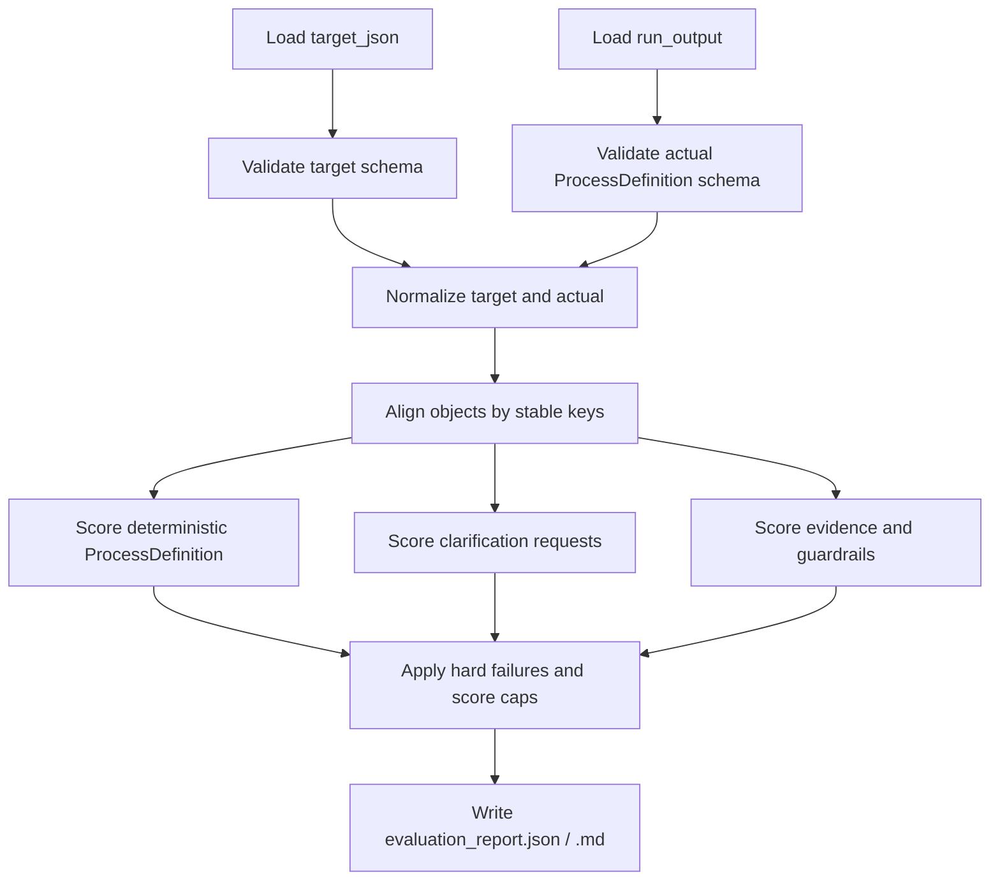

# LangGraph 流程抽取 Evaluation 方案

本文档定义 LangGraph 从多 source 初始化流程草稿后的离线 evaluation 方式。目标是衡量：

1. LangGraph 是否从 source 中抽取出正确的标准化流程定义。
2. LangGraph 是否识别出需要用户确认或补充的不确定项。
3. LangGraph 的结论是否有 source evidence 支撑，且没有违反关键 guardrail。

本文档中的 `target` 指 `data/*/standard/*_target.json`，不是 LangGraph 运行时可见的答案。Target 只用于最后 eval，不进入 prompt、validator 或 retry route。

## 1. Eval 输入与输出

### 1.1 输入

一次 eval 至少需要两个输入：

| 输入 | 来源 | 用途 |
|---|---|---|
| `target_json` | `data/<case>/standard/*_target.json` | gold target |
| `run_output` | `runs/<run_id>/` 或产品初始化返回结果 | LangGraph 实际输出 |

`run_output` 重点读取：

| 文件或字段 | 用途 |
|---|---|
| `workflow_design_output_writer/workflow_design_output.json` | 实际生成的流程定义、统计、校验状态 |
| `workflow_design_output_writer/user_clarification_requests.json` | 实际生成的待确认项 |
| `business_validation_agent/business_validation_result.json` | 业务校验结论和问题类型 |
| `source_ingestion/source_file_manifest.json` | source 文件与 chunk 映射 |
| `source_ingestion/source_chunks.json` | 可回查的 source chunk |
| `eval/comparison_report.json` | 当前已有 deterministic diff，可作为输入之一 |

如果产品侧直接调用初始化接口，也可以用接口返回里的：

| 字段 | 用途 |
|---|---|
| `draft_definition` | 实际生成的流程定义 |
| `generation_report.langgraph.workflow_design_output` | LangGraph 输出摘要 |
| `messages` | AI 设计助手初始回复 |

### 1.2 输出

建议输出两份文件：

```text
eval/evaluation_report.json
eval/evaluation_report.md
```

`evaluation_report.json` 建议结构：

```json
{
  "case_id": "01_leave_request",
  "target_file": "data/01_leave_request/standard/leave_request_target.json",
  "run_dir": "runs/01_leave_request_20260612_153000",
  "status": "needs_review",
  "score": {
    "total": 84.5,
    "deterministic_process_definition": 61.5,
    "clarification": 14.0,
    "evidence_and_guardrail": 9.0
  },
  "hard_failures": [],
  "caps_applied": [],
  "deterministic_eval": {},
  "clarification_eval": {},
  "evidence_eval": {},
  "guardrail_eval": {},
  "recommendations": []
}
```

## 2. Target JSON 结构与用途

每个 `*_target.json` 使用统一 wrapper：

| Section | 用途 | 是否计分 |
|---|---|---|
| `deterministic_process_definition` | 标准流程定义答案 | 是 |
| `clarification_targets` | 必须识别并询问的待确认项 | 是 |
| `accepted_optional_clarifications` | 可接受但非必须的待确认项 | 可选 bonus，不默认计入 100 分 |
| `forbidden_clarifications` | 不应该问的问题 | 是，命中扣分或 cap |
| `guardrail_targets` | 关键行为约束，例如线下样例不可直接当线上规则 | 是 |
| `evidence_map` | 目标字段、环节、路径、附件、角色对应的 source evidence | 是 |
| `eval_weights` | 当前 case 的权重覆盖配置 | 是 |

## 3. Eval 总体流程



步骤说明：

1. **Load**：读取 target 和 run output。
2. **Schema validation**：先确认 target 和 actual 都是合法结构。
3. **Normalize**：统一空值、空格、全角半角、日期、金额、比较符、常见中文条件表达。
4. **Object alignment**：按稳定 key 对齐字段、环节、路径、附件、角色。
5. **Scoring**：分别计算确定性定义、待确认项、证据与约束。
6. **Caps / Hard failures**：有严重错误时即使分数高，也要降级或失败。
7. **Report**：输出机器可读 JSON 和人工可读 Markdown。

## 4. 对象对齐规则

| 对象 | 主匹配 key | fallback | 说明 |
|---|---|---|---|
| `meta` | 固定字段 | 无 | `process_id`、`process_name`、`responsible_dept` 等逐项比较 |
| `form_fields` | `field_name` | 归一化字段名 | 中文字段名是主要稳定 key |
| `flow_nodes` | `node_id` | `node_name` | `node_id` 更稳定；LLM 可能生成不同英文 ID 时可 fallback |
| `submit_paths` | `source_node_id + path_name + target_node_id` | `source_node_name + normalized_condition + target_node_name` | 路径名和目标都重要 |
| `attachments` | `attachment_type` | 附件名称归一化 | 例如 `请假证明材料` |
| `roles` | `role_name` | 角色名称归一化 | 只评估流程自定义角色，不把部门主管等通用组织角色算作 custom role |
| `clarification_targets` | `id` / `topic` | `expected_question_contains` | 不要求逐字一致，按关键词和语义覆盖判断 |
| `evidence_map` | target item id | source file/chunk hint | 第一版可先检查文件名或 chunk id 是否覆盖 |

## 5. 归一化规则

第一版先做确定性归一化，减少无意义 diff。

| 类型 | 归一化方式 |
|---|---|
| 空值 | `null`、`""`、`[]`、`"-"` 按字段语义统一 |
| 空格 | 去掉首尾空格，中文条件中去掉多余空格 |
| 比较符 | `大于3天`、`>3天`、`超过3天` 归一化为 `>3天` |
| 小于等于 | `不超过3天`、`<=3天`、`3天以内` 归一化为 `<=3天` |
| 金额 | `5万`、`50000元` 在金额边界字段中归一化为同一数值 |
| 日期格式 | `yyyy-MM-dd`、`YYYY/MM/DD` 归一化为标准日期格式 |
| 枚举 | 去空格后 exact match |
| 中文同义动作 | `退回起草`、`返回起草` 可视为等价 |

复杂语义，例如“病假证明可否返岗后补交”和“证明材料是否允许事后补交”，第一版可用关键词匹配；后续可加入 LLM-as-judge 只判断语义等价，不直接决定总分。

## 6. 评分模型

默认总分 100：

| 大类 | 权重 |
|---|---:|
| 确定性流程定义 | 70 |
| 待确认项 | 20 |
| 证据与约束 | 10 |

### 6.1 确定性流程定义 70 分

| 子类 | 权重 | 计分重点 |
|---|---:|---|
| `meta` | 5 | 流程名称、负责部门、适用范围、入口等 |
| `form_fields` | 20 | 字段数量、字段名、组件类型、必填/可见/可编辑环节、选项、逻辑说明 |
| `flow_nodes` | 15 | 环节数量、环节名称、起草标识、处理人模式、处理人来源、处理角色、意见配置、期限 |
| `submit_paths` | 15 | 路径数量、source/target、路径名、条件 |
| `attachments` | 8 | 附件名称、上传环节、必填条件、说明 |
| `roles` | 7 | 流程自定义角色名称、类型、成员/部门、权限定位 |

对于 list 类对象，使用同一公式：

```text
category_score = weight * (
  0.60 * recall
  + 0.30 * attribute_accuracy
  + 0.10 * precision
)
```

定义：

```text
recall = matched_target_items / target_items
precision = matched_actual_items / actual_items
attribute_accuracy = matched_items_correct_attributes / matched_items_total_attributes
```

解释：

- recall 权重最高，因为漏掉关键字段、环节、路径比多抽一个备注更严重。
- attribute_accuracy 用来衡量匹配到的对象内部属性是否正确。
- precision 用来惩罚无根据的多抽取。

`meta` 不是 list，可以直接按字段计算：

```text
meta_score = 5 * correct_meta_fields / target_meta_fields
```

### 6.2 待确认项 20 分

| 子类 | 权重 | 说明 |
|---|---:|---|
| required clarification recall | 12 | target 必须问的问题是否问到 |
| question/options quality | 5 | 是否以可执行问题卡方式提问，是否给出合理建议/选项 |
| forbidden clarification | 3 | 是否没有问 target 禁止的问题 |

计算方式：

```text
required_score = 12 * matched_required_clarifications / target_required_clarifications

quality_score = 5 * quality_passed_clarification_cards / actual_required_related_cards

forbidden_score = 3 if forbidden_hits == 0 else max(0, 3 - forbidden_hits * 1.5)
```

问题卡质量第一版检查：

| 检查项 | 说明 |
|---|---|
| `question` | 问题明确，不只是罗列“缺失” |
| `recommendation` | 有默认建议或业务建议 |
| `options` | 有 2-4 个可选择项，且包含手动输入 |
| `evidence` | 可指出来自哪些 source 或说明 source 未明确 |
| `impact` | 说明不确认会影响哪些字段/路径/附件/角色 |

### 6.3 证据与约束 10 分

| 子类 | 权重 | 说明 |
|---|---:|---|
| evidence coverage | 5 | 关键 target 是否能对应到 source evidence |
| guardrail compliance | 5 | 是否遵守 target guardrail |

计算方式：

```text
evidence_score = 5 * evidence_covered_items / evidence_target_items

guardrail_score = 5 - guardrail_violation_penalty
```

常见 guardrail：

| Guardrail | 违规示例 | 建议处理 |
|---|---|---|
| 线下样例只作参考 | 把线下纸质流转样例原样变成线上审批节点 | cap total <= 70 |
| source 未明确则提出待确认 | 直接编造附件规则或审批角色 | 扣 evidence / clarification 分 |
| 通用组织角色不等于流程自定义角色 | 把“部门主管”写入 custom roles | roles 扣分 |
| target 明确有附件配置 | 输出 attachments 为空 | attachments 扣分，必要时 cap |

## 7. 硬失败与分数上限

### 7.1 Hard fail

以下情况直接 `status=fail`：

| 条件 | 原因 |
|---|---|
| actual JSON 非法或无法解析 | 没有可评估对象 |
| actual 不符合 `ProcessDefinition` schema | 不能进入产品设计页 |
| 缺起草环节 | 流程无法发起 |
| 缺结束环节或结束路径 | 流程无法闭环 |
| 缺核心审批主路径 | 流程无法运行 |

### 7.2 Score cap

以下情况不一定直接 fail，但总分设置上限：

| 条件 | 分数上限 |
|---|---:|
| 把线下样例当成线上正式规则 | 70 |
| 必须待确认项全部漏掉 | 80 |
| target 明确有附件但完全没抽到 | 80 |
| target 明确有流程自定义角色但完全没抽到 | 85 |
| 出现 forbidden clarification | 85 |
| evidence 基本缺失 | 85 |

最终分数：

```text
final_score = min(raw_score, all_applicable_caps)
```

## 8. 通过标准

| 总分 | 状态 | 说明 |
|---:|---|---|
| `>= 90` | `pass` | 可进入后续人工确认或发布前检查 |
| `80-89` | `needs_review` | 主体可用，但需要 owner 检查 |
| `< 80` | `fail` | 抽取或确认项质量不足 |

如果触发 hard fail，则无论分数多少都为 `fail`。

## 9. 评估报告建议格式

### 9.1 Markdown 报告

```md
# Evaluation Report: 01_leave_request

总分：84.5 / 100
状态：needs_review

## 分数

- 确定性流程定义：61.5 / 70
- 待确认项：14.0 / 20
- 证据与约束：9.0 / 10

## 主要问题

1. 缺失字段：紧急联系方式
2. 路径条件差异：部门领导审批 -> 流程结束，expected `同意 且 请假天数 <= 3`，actual `同意`
3. 附件配置不完整：请假证明材料缺少“病假/婚假/产假等需证明”的条件说明
4. 缺失待确认项：返岗后是否允许补交请假证明

## 建议

- 优化 process_extraction_agent 对附件条件的抽取。
- business_validation_agent 应在 source 未明确附件补交规则时生成待确认卡片。
```

### 9.2 JSON 报告

```json
{
  "status": "needs_review",
  "score": {
    "total": 84.5,
    "raw_total": 84.5,
    "caps": []
  },
  "deterministic_eval": {
    "form_fields": {
      "score": 18.2,
      "weight": 20,
      "missing": ["紧急联系方式"],
      "extra": [],
      "differences": []
    }
  },
  "clarification_eval": {
    "score": 14,
    "missing_required_clarifications": [
      "返岗后是否允许补交请假证明"
    ],
    "matched_required_clarifications": [
      "请假天数超过3天时是否由部门总经理审批"
    ],
    "forbidden_clarification_hits": []
  }
}
```

## 10. 完整计算样例

下面用一个简化的 01 请假申请 eval 说明怎么算分。

### 10.1 Target 摘要

```text
target:
- 10 个表单字段
- 4 个流程环节
- 9 条提交路径
- 1 个附件配置：请假证明材料
- 1 个流程自定义角色：请假流程管理员
- 2 个必须待确认项
```

### 10.2 LangGraph 实际输出摘要

```text
actual:
- 9 个表单字段，漏掉“紧急联系方式”
- 4 个流程环节，全部匹配
- 8 条提交路径，漏掉“返回上一处理人”
- 1 条路径条件不完整：部门领导审批 -> 流程结束，只写了“同意”，漏了“请假天数 <= 3”
- 1 个附件配置，名称正确，但必填条件只写了“病假需要证明”，漏了婚假/产假/陪产假/丧假
- 1 个流程自定义角色，完全正确
- 2 个必须待确认项中问到了 1 个，漏掉“证明材料是否允许返岗后补交”
- 没有 forbidden clarification
- evidence 覆盖 8/9 个关键项
- 无 guardrail 违规
```

### 10.3 分项计算

#### meta：5 / 5

```text
流程名称、负责部门、适用范围、入口均正确。

score = 5 * 4/4 = 5
```

#### form_fields：18.2 / 20

```text
target_items = 10
actual_items = 9
matched_items = 9

recall = 9 / 10 = 0.90
precision = 9 / 9 = 1.00
attribute_accuracy = 0.92

score = 20 * (0.60*0.90 + 0.30*0.92 + 0.10*1.00)
      = 20 * (0.54 + 0.276 + 0.10)
      = 18.32
      ≈ 18.3
```

#### flow_nodes：15 / 15

```text
target_items = 4
actual_items = 4
matched_items = 4

recall = 1.00
precision = 1.00
attribute_accuracy = 1.00

score = 15 * 1.00 = 15
```

#### submit_paths：12.1 / 15

```text
target_items = 9
actual_items = 8
matched_items = 8

recall = 8 / 9 = 0.889
precision = 8 / 8 = 1.00

路径属性总计：
- 8 条匹配路径
- 每条看 target_node_id、path_name、condition 3 类关键属性
- 24 个关键属性中 22 个正确，2 个条件相关错误

attribute_accuracy = 22 / 24 = 0.917

score = 15 * (0.60*0.889 + 0.30*0.917 + 0.10*1.00)
      = 15 * (0.533 + 0.275 + 0.10)
      = 13.62
      ≈ 13.6
```

如果漏掉的是核心主路径而不是辅助退回路径，可以额外加 critical penalty，例如扣 1.5 分：

```text
adjusted_submit_paths_score = 13.6 - 1.5 = 12.1
```

#### attachments：5.6 / 8

```text
target_items = 1
actual_items = 1
matched_items = 1

recall = 1.00
precision = 1.00

关键属性：
- attachment_type 正确
- upload_stages 正确
- required_stages 正确
- 条件说明不完整

attribute_accuracy = 3 / 4 = 0.75

score = 8 * (0.60*1.00 + 0.30*0.75 + 0.10*1.00)
      = 8 * (0.60 + 0.225 + 0.10)
      = 7.4
```

如果 target 明确附件条件是本 case 新增测试重点，可以对条件缺失加专项 penalty 1.8：

```text
adjusted_attachments_score = 7.4 - 1.8 = 5.6
```

#### roles：7 / 7

```text
target_items = 1
actual_items = 1
matched_items = 1

role_name、role_type、members、department、permission_scope 均正确。

score = 7
```

#### 确定性流程定义小计

```text
meta:          5.0
form_fields:  18.3
flow_nodes:   15.0
submit_paths: 12.1
attachments:  5.6
roles:         7.0

deterministic_total = 63.0 / 70
```

### 10.4 待确认项计算

```text
target_required_clarifications = 2
matched_required_clarifications = 1

required_score = 12 * 1/2 = 6

actual_required_related_cards = 1
quality_passed_cards = 1
quality_score = 5 * 1/1 = 5

forbidden_hits = 0
forbidden_score = 3

clarification_total = 6 + 5 + 3 = 14 / 20
```

### 10.5 证据与约束计算

```text
evidence_target_items = 9
evidence_covered_items = 8

evidence_score = 5 * 8/9 = 4.44

guardrail_score = 5

evidence_and_guardrail_total = 4.44 + 5 = 9.44 ≈ 9.4 / 10
```

### 10.6 总分

```text
raw_total = deterministic_total + clarification_total + evidence_and_guardrail_total
          = 63.0 + 14.0 + 9.4
          = 86.4
```

没有 hard failure。  
没有 cap。

```text
final_score = 86.4
status = needs_review
```

### 10.7 报告结论样例

```text
结论：needs_review

主体流程可用，但还有三个问题：
1. 漏掉“紧急联系方式”字段。
2. 部门领导审批到流程结束的条件不完整，缺少“请假天数 <= 3”。
3. 附件条件抽取不完整，且漏问“返岗后是否允许补交请假证明”。

建议：
- 优化 extraction prompt 对附件条件和路径条件的约束。
- business_validation_agent 对附件规则不完整时必须生成 clarification card。
- 如果 source 没明确补交规则，不要默认允许或禁止，应进入待确认项。
```

## 11. 后续实现建议

第一版实现可以放在：

```text
app/eval/process_target_eval.py
```

建议 CLI：

```bash
uv run python -m app.eval.process_target_eval \
  --run runs/01_leave_request_20260612_153000 \
  --target data/01_leave_request/standard/leave_request_target.json
```

后续可接入：

1. LangGraph run 结束后自动生成 `eval/evaluation_report.json`。
2. 产品 AI 设计页显示 eval 摘要。
3. LangSmith dataset evaluator，用四套 target 做回归集。
4. 对路径条件、附件条件、clarification 语义匹配加入 LLM-as-judge，但只作为补充，不替代 deterministic score。
