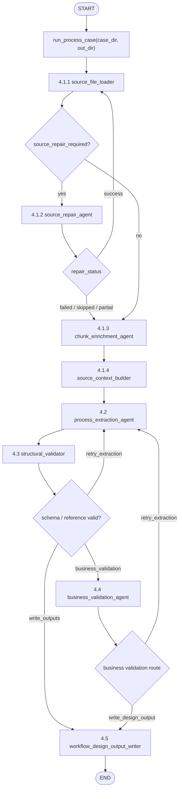

# LangGraph 工作流最新方案说明

本文档记录我们讨论后的最新目标方案：从多类型 source 输入开始，经 source ingestion、chunk catalog、流程抽取、结构校验、业务校验，最终形成可落库、可在 AI 流程设计页展示、可继续对话补充的流程草稿。

代码入口与现状注记：

- CLI / 测试入口：`app/workflows/process_v1.py`
- 产品 AI 初始化入口：`app/api/workflow_design_service.py`
- 流程标准 Schema：`data/schema/process_schema.py`
- Agent 文件：`app/agents/process_extraction.py`、`app/agents/business_validation.py`
- 当前代码还未完全实现 4.1 多源 ingestion，本文件以后续目标方案为准。

## 1. LangGraph 全局流程



```text
run_process_case(case_dir, out_dir)
  |
  v
source_file_loader
  |-- repair_needed --> source_repair_agent
  |                       |
  |                       v
  |                    source_file_loader
  |
  |-- continue
  v
chunk_enrichment_agent
  |
  v
source_context_builder
  |
  v
process_extraction_agent
  |
  v
structural_validator
  |-- retry_extraction --> process_extraction_agent
  |-- business_validation --> business_validation_agent
  |-- write_outputs --> workflow_design_output_writer
                             |
                             v
                            END

business_validation_agent
  |-- retry_extraction --> process_extraction_agent
  |-- write_design_output --> workflow_design_output_writer
  |
  v
END
```

目标节点总览：

| 节点 | 类型 | 状态 | 作用 |
|---|---|---|---|
| `source_file_loader` | 确定性 function node + parser tools | 待开发 | 高召回读取 Word、Excel、PPT、PDF、图片、聊天记录等 source，输出 source chunks |
| `source_repair_agent` | 受限 LLM agent node + sandbox command tools | 待开发 | 对高风险解析 warning 做受控修复尝试，成功后回到 `source_file_loader` 重解析 |
| `chunk_enrichment_agent` | LLM agent node | 待开发 | 对 chunk 做摘要、打标、候选流程要素识别，生成 source catalog |
| `source_context_builder` | 确定性 function node + retrieval tools | 待开发 | 构建 prompt 上下文、source index 和回查工具 |
| `process_extraction_agent` | Agent node | 已实现，待接入 source 回查工具 | 从 source context / catalog 抽取 `ProcessDefinition` |
| `structural_validator` | 确定性 function node | 已实现 | 做 Pydantic/schema/引用完整性校验 |
| `business_validation_agent` | Agent node | 已实现基础版，待接入 source evidence tools | 基于 source evidence 审核候选流程定义的业务完整性，输出结构化校验结果和用户确认项 |
| `workflow_design_output_writer` | 确定性 function node | 待重构 | 落库流程草稿、生成 AI 设计页展示数据、生成对话窗口回复、写出 eval/manifest |

## 2. 运行入口

### 2.1 CLI

```bash
uv run python -m app.workflows.process_v1 --case data/01_leave_request
```

常用参数：

| 参数 | 说明 |
|---|---|
| `--case` | 必填，流程数据目录，例如 `data/01_leave_request` |
| `--out` | 输出目录前缀；不填时默认 `runs/<case_name>_<YYYYMMDD_HHMMSS>` |
| `--no-timestamp` | 使用 `--out` 原值，不追加时间戳 |
| `--verbose` | 打印 LLM raw output 和路由日志 |

### 2.2 产品 AI 初始化

产品页“AI 初始化”目标上复用同一条 LangGraph 初始化链路：

```text
workflow_design_initialize API
  -> WorkflowDesignService.initialize_new_session()
  -> _initialize_definition_with_langgraph()
  -> _run_langgraph_initialization()
  -> run_process_case(..., artifact_agent=_DesignInitializationArtifactAgent())
```

产品初始化链路的边界：

- 输入来自前端上传 source、补充说明或纯文本需求。
- 目标方案里由 `source_file_loader` 统一解析多类型 source。
- 初始化输入进入同一套 `source_file_loader -> source_repair_agent 可选支线 -> chunk_enrichment_agent -> source_context_builder` 链路。
- 会调用同一条 LangGraph 抽取 + 校验链路。
- 结果直接进入设计会话草稿，不再经过 Excel / draw.io 产物生成节点。
- 输出目录在 `data/runtime/design_initializations/<session_id>/`。
- 当前是同步调用，不是 streaming job；如果要在前端显示真实节点进度，后续要改成 async job + polling/SSE，或基于 LangGraph stream events 暴露节点状态。

## 3. WorkflowState 字段

`WorkflowState` 是 LangGraph 节点之间传递的状态对象，定义在 `app/workflows/state.py`。

| 字段 | 来源 | 说明 |
|---|---|---|
| `case_dir` | 初始输入 | 流程 case 目录 |
| `out_dir` | 初始输入 | 本次 run 输出目录 |
| `verbose` | 初始输入 | 是否打印详细日志 |
| `process_domain_hint` | 初始输入 | 用户在初始化入口填写的流程名称、流程分类、补充说明等全局提示；可为空 |
| `case_id` | `source_file_loader` | case 目录名或初始化 session 对应的 source bundle id |
| `source_package_ref` | `source_file_loader` | 本次 source 解析包的 package_id / 落盘目录引用 |
| `source_file_manifest` | `source_file_loader` | 原始 source 文件清单，以及 source 文件到 chunk_id 的映射 |
| `source_chunks` | `source_file_loader` | 标准化后的 text/table/slide/page/message chunks |
| `ingestion_warnings` | `source_file_loader` | 文件无法读取、OCR 缺失、隐藏内容等解析风险 |
| `source_repair_required` | `source_file_loader` | 是否需要进入 source repair 支线 |
| `source_repair_attempt_count` | graph route | 当前 source repair 尝试次数，默认最多 1 |
| `source_repair_report` | `source_repair_agent` | 修复尝试、命令、结果、失败原因和后续建议 |
| `repaired_sources` | `source_repair_agent` | 修复后生成的可重读文件或临时解析产物 |
| `parser_improvement_suggestions` | `source_repair_agent` | 可沉淀回 parser 的规则或代码改进建议 |
| `chunk_catalog` | `chunk_enrichment_agent` | chunk 摘要、标签、关键词、候选流程要素 |
| `evidence_index` | `chunk_enrichment_agent` | 按字段/环节/路径/角色/附件聚合的证据索引 |
| `source_quality_findings` | `chunk_enrichment_agent` | 对 parser warning 的业务影响解释，例如某个隐藏 sheet 可能导致审批矩阵缺失 |
| `source_index` | `source_context_builder` | 支持 `search_source_chunks` / `get_source_chunk` 的回查索引 |
| `selected_seed_chunks` | `source_context_builder` | 首轮直接给 extraction agent 的高相关原文 chunk |
| `source_catalog_context` | `source_context_builder` | 给 extraction agent 的摘要目录上下文 |
| `source_context` | `source_context_builder` | 给 extraction agent 的首轮上下文 |
| `candidate_process` | `process_extraction_agent` | 候选 `ProcessDefinition` |
| `llm_raw_output` | `process_extraction_agent` | 抽取 agent 原始输出 |
| `schema_errors` | `process_extraction_agent` / `structural_validator` | schema 或引用错误 |
| `schema_validation_report` | `structural_validator` | 结构校验报告 |
| `business_validation_result` | `business_validation_agent` | 业务校验结果 |
| `business_validation_raw_output` | `business_validation_agent` | 业务校验 agent 原始输出 |
| `user_clarification_requests` | `business_validation_agent` | 需要用户确认或补充的问题列表 |
| `validation_feedback` | validator | 返回给 extraction agent 的修复反馈 |
| `should_retry_extraction` | validator | 是否回到 `process_extraction_agent` |
| `workflow_design_output` | `workflow_design_output_writer` | 给产品 AI 设计页使用的最终结构化输出 |
| `designer_assistant_message` | `workflow_design_output_writer` | 写入 AI 流程设计对话窗口的 assistant 消息 |
| `design_persistence_report` | `workflow_design_output_writer` | 草稿落库/更新结果 |
| `validation_retry_count` | graph route | 当前重试次数 |
| `max_validation_retries` | 初始输入 | 默认 1 |
| `output_paths` | `workflow_design_output_writer` | 最终 manifest |

## 4. 节点明细

### 4.1 Source Ingestion：从原始材料到 source context

状态：目标方案；待开发。  
建议文件：`app/workflows/source_ingestion.py`、`app/tools/source_parsers.py`、`app/agents/source_repair.py`、`app/agents/chunk_enrichment.py`

4.1 的目标不是抽取流程定义，而是把用户上传的各种 source 变成 4.2 可以可靠消费、可追踪、可回查的 source package。

目标结构：

```text
4.1.1 source_file_loader
  -> 识别文件类型
  -> 调用确定性 parser / connector
  -> 高召回提取 text / table / slide / page / message
  -> 输出 source_package_ref + source_file_manifest + source_chunks + ingestion_warnings + source_repair_required

4.1.2 source_repair_agent
  -> 仅在 source_repair_required=true 时运行
  -> 读取 ingestion_warnings、source_file_manifest、原始文件路径
  -> 在受限 workspace 中尝试格式转换、OCR、XML 解包、临时解析脚本等修复
  -> 修复成功：输出 repaired_sources，回到 source_file_loader 重新解析
  -> 修复失败：输出 source_repair_report，继续带 warning 进入后续链路

4.1.3 chunk_enrichment_agent
  -> 读取 source_file_loader 产出的 source_chunks
  -> 读取初始输入里的 process_domain_hint
  -> 对每个 chunk 生成摘要、标签、候选流程要素、风险提示
  -> 输出 chunk_catalog / evidence_index

4.1.4 source_context_builder
  -> 小文件：原文 chunk 可全部进入 prompt
  -> 大文件：source_catalog + 高相关 chunk 原文进入 prompt
  -> 建 source index，提供 search/get chunk 工具

4.2 process_extraction_agent
  -> 先读 source_catalog / compressed context
  -> 必要时调用 search_source_chunks / get_source_chunk 回查原文
  -> 生成 ProcessDefinition
```

#### 4.1.1 `source_file_loader`

类型：确定性 function node + parser tools  
状态：待开发

职责：

- 把原始文件内容尽量完整读出来。
- 不判断“哪些是流程字段/审批环节/路径条件”。
- 不做业务摘要。
- 保留文件名、页码、sheet、slide、段落、单元格范围、消息时间等来源位置。
- 对无法读取或可能不完整的内容输出 warning，不静默丢弃。

输入：

| 字段 | 说明 |
|---|---|
| `case_dir` 或 `uploaded_sources` | source 文件集合 |
| `uploaded_source_manifest` | 用户上传时的文件名、文件类型、上传时间、补充说明 |

输出：

| 字段 | 说明 |
|---|---|
| `source_package_ref` | source 解析包引用；用于指向本次落盘的 manifest、chunks、warnings 等产物 |
| `source_file_manifest` | 原文件清单，以及每个原文件包含哪些 `chunk_id` |
| `source_chunks` | LLM 可消费的 chunk 列表 |
| `ingestion_warnings` | 解析不完整、OCR 缺失、隐藏内容等 warning |
| `source_repair_required` | 是否需要进入 `source_repair_agent` 修复支线 |

字段边界：

- `source_package_ref` 只指向这批 source 解析产物，不重复保存 chunk 内容或映射。
- `source_file_manifest` 保存文件级信息和 `file -> chunk_ids` 映射，但不保存 chunk 正文。
- `source_chunks` 保存 chunk 正文、表格、位置和 metadata，是后续 agent 回查原文的主要事实来源。
- `ingestion_warnings` 保存解析风险，方便判断是 source 缺失、parser 漏读还是 agent 漏抽。
- `source_repair_required` 是 LangGraph 条件边信号；只有 blocking/high-risk warning 才进入修复支线。

样例输出：

```json
{
  "source_package_ref": {
    "package_id": "leave_request_sources",
    "package_dir": "runs/01_leave_request_20260611_103000/source_ingestion"
  },
  "source_file_manifest": [
    {
      "source_id": "src_001",
      "file_name": "01_需求说明文档.docx",
      "source_type": "docx",
      "chunk_count": 8,
      "chunk_ids": ["src_001_c001", "src_001_c002", "src_001_c003"],
      "status": "parsed"
    },
    {
      "source_id": "src_002",
      "file_name": "02_审批矩阵.xlsx",
      "source_type": "xlsx",
      "chunk_count": 3,
      "chunk_ids": ["src_002_s1_r1_r20", "src_002_s2_r1_r12"],
      "status": "parsed"
    }
  ],
  "source_chunks": [
    {
      "chunk_id": "src_001_c003",
      "source_id": "src_001",
      "source_file": "01_需求说明文档.docx",
      "source_type": "docx",
      "content_type": "text",
      "location": {
        "section": "审批流程",
        "paragraph": 12
      },
      "text": "员工请假由本人发起，直属主管审批后，部门负责人审批。请假超过3天需要部门总经理审批。",
      "metadata": {
        "page": null,
        "sheet": null,
        "slide": null
      }
    }
  ],
  "ingestion_warnings": [
    {
      "warning_id": "src_002_w001",
      "source_id": "src_002",
      "level": "warning",
      "repairable": true,
      "message": "工作簿存在隐藏 sheet，当前版本只解析可见 sheet。",
      "suggested_repair": "retry_xlsx_with_hidden_sheets"
    }
  ],
  "source_repair_required": true
}
```

推荐 chunk 结构：

```json
{
  "chunk_id": "src_001_c012",
  "source_id": "src_001",
  "source_file": "员工请假制度.docx",
  "source_type": "docx",
  "content_type": "text",
  "location": {
    "section": "审批流程",
    "paragraph": 12
  },
  "text": "员工请假 3 天以内由部门负责人审批，超过 3 天报部门总经理审批。",
  "metadata": {
    "page": null,
    "sheet": null,
    "slide": null
  }
}
```

表格 chunk 示例：

```json
{
  "chunk_id": "src_002_s1_r1_r20",
  "source_id": "src_002",
  "source_file": "审批矩阵.xlsx",
  "source_type": "xlsx",
  "content_type": "table",
  "location": {
    "sheet": "Sheet1",
    "range": "A1:F20"
  },
  "text": "| 请假天数 | 审批人 | 路径 |\n| <=3天 | 部门负责人 | 结束 |\n| >3天 | 部门总经理 | 审批 |",
  "table": {
    "columns": ["请假天数", "审批人", "路径"],
    "rows": [
      ["<=3天", "部门负责人", "结束"],
      [">3天", "部门总经理", "审批"]
    ]
  }
}
```

`source_file_loader` 需要的 parser / tool：

| Tool / 函数 | 输入 | 输出 | 说明 |
|---|---|---|---|
| `detect_source_type(path)` | 文件路径 | MIME / 扩展名 / source_type | 统一分发解析器 |
| `parse_txt_or_md(path)` | `.txt` / `.md` | text chunks | 当前 txt loader 的泛化版 |
| `parse_docx(path)` | `.docx` | paragraph/table chunks | 用 `python-docx` 读取段落、标题、表格 |
| `convert_doc_to_docx(path)` | `.doc` | `.docx` 临时文件 | 老 Word 格式转换，优先 LibreOffice/textutil |
| `parse_xlsx(path)` | `.xlsx` | sheet/table chunks | 用 `openpyxl` 读取 sheet、非空区域、合并单元格、批注 |
| `parse_xls(path)` | `.xls` | sheet/table chunks | 可先转 xlsx，或用 pandas/xlrd 读取 |
| `parse_csv(path)` | `.csv` | table chunks | 自动识别编码、分隔符、表头 |
| `parse_pptx(path)` | `.pptx` | slide/text/table/note chunks | 用 `python-pptx` 读取 slide 文本、表格、备注 |
| `parse_pdf_text(path)` | text PDF | page/text/table chunks | 用 PyMuPDF/pdfplumber 读取文本页和表格 |
| `parse_pdf_ocr(path)` | 扫描 PDF | page OCR chunks | OCR 作为后续增强，输出 warning 和 OCR 文本 |
| `parse_image_ocr(path)` | png/jpg/jpeg | OCR chunks | 图片、截图、扫描件文字提取 |
| `parse_email_export(path)` | eml/msg/邮件导出 | message chunks | 后续支持邮件 source |
| `parse_chat_export(path)` | Slack/飞书/Teams 导出 | thread/message chunks | 把聊天按 thread、时间、参与人整理 |
| `normalize_source_chunks(raw_chunks)` | parser 输出 | `source_chunks` | 统一字段、chunk_id、location、metadata |
| `render_table_to_markdown(table)` | 表格对象 | markdown table text | 让 LLM 可以直接读表格 |
| `write_source_package(package)` | package | JSON 文件 | 落盘 source package 引用、manifest、chunks 和 warning |

解析原则：

1. 高召回优先，宁可多读，不要过早筛掉内容。
2. parser 不做业务判断，只做内容读取和结构保留。
3. 如果有隐藏 sheet、图片、扫描页、嵌入对象、复杂合并单元格，要输出 `ingestion_warnings`。
4. 原文 chunk 必须可通过 `chunk_id` 回查。
5. 如果 warning 属于可修复的 blocking/high-risk parser 问题，设置 `source_repair_required=true`。

#### 4.1.2 `source_repair_agent`

类型：受限 LLM agent node + sandbox command tools  
状态：待开发

触发条件：

- `source_file_loader` 输出 `source_repair_required=true`。
- 或 `ingestion_warnings` 中存在 `level=blocking`。
- 或 `ingestion_warnings` 中存在 `repairable=true` 且影响关键 source，例如审批矩阵、制度正文、会议纪要、聊天记录主线程。
- 默认最多尝试 1 次；避免在坏文件上无限循环。

职责：

- 只修复 source 解析问题，不抽取流程定义，不判断业务流程。
- 根据 `ingestion_warnings` 选择合适的修复策略。
- 在受限 repair workspace 中执行命令或生成临时解析脚本。
- 修复成功后输出 `repaired_sources`，让 graph 回到 `source_file_loader` 重新解析。
- 修复失败后输出 `source_repair_report`，说明失败原因和建议用户补充什么。
- 如果发现 parser 规则可以沉淀，输出 `parser_improvement_suggestions`，但不自动修改主代码。

输入：

| 字段 | 说明 |
|---|---|
| `source_package_ref` | 当前 source ingestion 的 package 引用 |
| `source_file_manifest` | 原始文件清单和 source_id |
| `ingestion_warnings` | `source_file_loader` 发现的 parser warning |
| `uploaded_sources` / `case_dir` | 原始 source 文件路径集合 |
| `repair_workspace` | 只允许写入的临时修复目录，例如 `<out_dir>/source_ingestion/repair_workspace` |
| `source_repair_attempt_count` | 当前修复尝试次数 |

输出：

| 字段 | 说明 |
|---|---|
| `repair_status` | `success / failed / skipped / partial` |
| `repair_plan` | 针对每个 warning 的修复计划 |
| `commands_executed` | 实际执行过的受控命令及结果 |
| `repaired_sources` | 修复后可重新解析的文件或临时文本/表格产物 |
| `source_repair_report` | 修复计划、执行命令、结果、失败原因、用户行动建议 |
| `parser_improvement_suggestions` | 可沉淀回正式 parser 的规则建议 |
| `source_repair_required` | 修复后是否仍需继续修复；通常置为 `false` |

路由规则：

```text
source_file_loader
  -> source_repair_required=false
       -> chunk_enrichment_agent

source_file_loader
  -> source_repair_required=true
       -> source_repair_agent

source_repair_agent
  -> repair_status=success
       -> source_file_loader(repaired_sources)

source_repair_agent
  -> repair_status=failed 或 skipped
       -> chunk_enrichment_agent
```

修复策略：

| warning 类型 | 优先策略 | 成功输出 | 失败输出 |
|---|---|---|---|
| `unknown_file_type` | `file` / MIME 检测真实类型，按真实类型重命名副本 | repaired file | 标记无法识别 |
| `legacy_doc` | `textutil` 或 LibreOffice 转 `.docx` / `.txt` | converted docx/txt | 要求用户提供 docx/pdf |
| `legacy_xls` | LibreOffice 转 `.xlsx`，或 pandas/xlrd 读取 | converted xlsx/csv | 要求用户提供 xlsx/csv |
| `hidden_sheet_not_parsed` | 用 openpyxl 读取 hidden/veryHidden sheet | extracted hidden sheet chunks | 提示 parser 需增强 |
| `merged_cells_complex` | 用 openpyxl 展开 merged ranges，补齐单元格值 | normalized xlsx/csv | 保留 warning |
| `pdf_no_text_layer` | 尝试 OCR 或转图片后 OCR | OCR text chunks | 要求用户提供可复制文本版 |
| `docx_xml_parse_error` | unzip docx，读取 `word/document.xml` 和 tables XML | extracted text/table | 要求用户重新导出文件 |
| `pptx_notes_missing` | unzip pptx，读取 notesSlides XML | extracted notes text | 标记备注无法解析 |
| `encoding_error` | 尝试 `utf-8-sig` / `gb18030` / `big5` / `latin1` | decoded text | 要求用户转 UTF-8 |
| `encrypted_file` | 不尝试破解 | 无 | 要求用户提供未加密文件 |

可用工具：

| Tool | 输入 | 输出 | 说明 |
|---|---|---|---|
| `inspect_file_metadata(path)` | 文件路径 | MIME、大小、hash、扩展名 | 包装 `file` 和 Python mimetypes |
| `run_repair_command(command_id, args)` | 白名单命令 ID + 参数 | stdout/stderr/exit_code | 只能执行预定义命令模板 |
| `write_repair_script(script_name, code)` | 脚本名 + Python 代码 | 脚本路径 | 只写入 repair workspace |
| `execute_repair_script(script_path, args)` | repair workspace 内脚本 | stdout/stderr/产物路径 | 用项目 Python 环境执行 |
| `list_repair_workspace()` | 无 | 文件列表 | 只能查看 repair workspace |
| `read_repair_artifact(path)` | repair workspace 文件 | 文本预览 | 读取修复产物 |
| `emit_repaired_source(source_id, path, source_type)` | source_id + 产物路径 | repaired source record | 交回 `source_file_loader` |
| `emit_repair_report(report)` | report JSON | `source_repair_report` | 落盘修复报告 |

Bash 命令白名单：

这些不是让 agent 任意写 shell，而是固定 `command_id -> 命令模板`。所有输入路径必须在原始 source 目录或 repair workspace 内，所有输出必须写入 repair workspace。

```yaml
repair_command_allowlist:
  inspect_file:
    command: ["file", "--mime-type", "--brief", "{input_path}"]
    writes: false

  inspect_file_verbose:
    command: ["file", "{input_path}"]
    writes: false

  textutil_doc_to_docx:
    command: ["textutil", "-convert", "docx", "-output", "{output_path}", "{input_path}"]
    writes: true
    output_must_be_under: "{repair_workspace}"

  textutil_doc_to_txt:
    command: ["textutil", "-convert", "txt", "-output", "{output_path}", "{input_path}"]
    writes: true
    output_must_be_under: "{repair_workspace}"

  libreoffice_convert_to_docx:
    command: ["soffice", "--headless", "--convert-to", "docx", "--outdir", "{repair_workspace}", "{input_path}"]
    writes: true
    optional: true

  libreoffice_convert_to_xlsx:
    command: ["soffice", "--headless", "--convert-to", "xlsx", "--outdir", "{repair_workspace}", "{input_path}"]
    writes: true
    optional: true

  unzip_office_file:
    command: ["python", "-m", "zipfile", "-e", "{input_path}", "{output_dir}"]
    writes: true
    output_must_be_under: "{repair_workspace}"

  run_python_repair_script:
    command: ["uv", "run", "python", "{script_path}", "--input", "{input_path}", "--output-dir", "{repair_workspace}"]
    writes: true
```

禁止命令：

- 禁止 `rm -rf`、`mv` 覆盖原文件、`git`、`curl`、`wget`、`pip install`、`brew install`。
- 禁止执行任意未登记 shell 字符串。
- 禁止访问 workspace 外路径，除非是系统只读命令读取原始 source 文件。
- 禁止把修复结果直接写进 `app/tools/source_parsers.py` 或其他主代码文件。
- 禁止上传文件、访问网络、读取密钥或环境变量。

推荐系统 prompt：

```text
你是 Source Repair Agent，负责在流程设计系统的 source ingestion 阶段修复文件解析问题。

你的目标：
1. 只处理文件读取、格式转换、OCR、表格/文档解析不完整等 source ingestion 问题。
2. 不抽取流程字段、审批环节、路径条件、角色或附件要求。
3. 不根据业务常识补全缺失内容。
4. 所有修复必须保留 source_id、原文件名、修复产物路径、执行命令和失败原因。
5. 修复成功后，输出 repaired_sources，让 source_file_loader 重新解析。
6. 修复失败后，输出 source_repair_report，明确建议是“用户补 source”还是“开发 parser 能力”。

安全边界：
- 只能使用提供的工具和命令白名单。
- 只能写入 repair_workspace。
- 不能删除或覆盖原始 source 文件。
- 不能修改项目主代码。
- 不能联网安装依赖。

判断原则：
- 如果 warning 可以通过格式转换、读取隐藏内容、解包 Office XML、编码重试或 OCR 尝试解决，则给出最小修复计划并执行。
- 如果文件加密、损坏严重、缺少原始附件或需要业务判断，则不要强行修复，输出失败原因和用户补充建议。
- 如果修复发现正式 parser 应增强，写入 parser_improvement_suggestions，但不要自动改代码。

输出必须是 JSON，不要输出 Markdown。
```

推荐 user prompt 模板：

```text
请根据以下 source ingestion warning 尝试修复解析问题。

repair_workspace:
{repair_workspace}

source_file_manifest:
{source_file_manifest}

ingestion_warnings:
{ingestion_warnings}

原始 source 路径：
{uploaded_sources}

要求：
1. 先给出 repair_plan。
2. 只执行必要的白名单工具。
3. 成功时输出 repaired_sources。
4. 失败时输出 failure_reason 和 recommended_action。
5. 不要抽取流程定义。
```

输出 JSON schema：

```json
{
  "repair_status": "success | failed | skipped | partial",
  "repair_plan": [
    {
      "warning_id": "src_002_w001",
      "source_id": "src_002",
      "strategy": "retry_xlsx_with_hidden_sheets",
      "reason": "隐藏 sheet 可能包含审批矩阵补充规则。"
    }
  ],
  "commands_executed": [
    {
      "command_id": "run_python_repair_script",
      "args": {
        "script_path": "runs/.../repair_workspace/extract_hidden_sheets.py",
        "input_path": "data/.../审批矩阵.xlsx"
      },
      "exit_code": 0,
      "stdout_excerpt": "extracted 2 hidden sheets",
      "stderr_excerpt": ""
    }
  ],
  "repaired_sources": [
    {
      "source_id": "src_002",
      "original_path": "data/.../审批矩阵.xlsx",
      "repaired_path": "runs/.../repair_workspace/src_002_hidden_sheets.xlsx",
      "source_type": "xlsx",
      "repair_method": "extract_hidden_sheets",
      "should_rerun_source_file_loader": true
    }
  ],
  "source_repair_report": {
    "summary": "已提取隐藏 sheet 并生成可重读 xlsx。",
    "remaining_warnings": [],
    "user_action_required": false,
    "recommended_action": "rerun_source_file_loader"
  },
  "parser_improvement_suggestions": [
    {
      "parser": "parse_xlsx",
      "suggestion": "默认读取 hidden/veryHidden sheets，并在 metadata.visibility 中标记可见性。",
      "evidence": "src_002 hidden sheet contained approval matrix rows."
    }
  ],
  "source_repair_required": false
}
```

失败样例：

```json
{
  "repair_status": "failed",
  "repair_plan": [
    {
      "warning_id": "src_004_w001",
      "source_id": "src_004",
      "strategy": "decrypt_or_extract",
      "reason": "文件被加密，无法解析正文。"
    }
  ],
  "commands_executed": [],
  "repaired_sources": [],
  "source_repair_report": {
    "summary": "文件加密，系统不会尝试破解。",
    "remaining_warnings": ["src_004_w001"],
    "user_action_required": true,
    "recommended_action": "请上传未加密版本，或把关键制度条款复制为文本 source。"
  },
  "parser_improvement_suggestions": [],
  "source_repair_required": false
}
```

落盘建议：

```text
<out_dir>/source_ingestion/repair_workspace/
├── repair_plan.json
├── source_repair_report.json
├── commands_executed.jsonl
├── generated_scripts/
│   └── extract_hidden_sheets.py
└── repaired_sources/
    └── src_002_hidden_sheets.xlsx
```

实施约束：

1. `source_repair_agent` 最多跑一次，后续可配置为 2 次，但默认不允许无限循环。
2. 修复成功后必须回到 `source_file_loader`，由统一 parser 重新生成 `source_chunks`。
3. 如果修复 agent 产出的是临时 text/table 文件，也要作为新的 repaired source 输入 loader，而不是直接绕过 loader 塞给 4.2。
4. parser 改进建议只进入报告和 backlog，不自动修改主代码。
5. 如果 repair 失败，后续 4.1.3/4.2 仍可继续，但最终 missing report 必须显示 `source_repair_report` 和用户行动建议。

#### 4.1.3 `chunk_enrichment_agent`

类型：LLM agent node  
状态：待开发

职责：

- 读取 `source_file_loader` 已经转成文本/表格的 `source_chunks`。
- 默认不再调用 `read_docx` / `read_xlsx` / `read_pptx` 等原始文件读取工具。
- 对每个 chunk 生成摘要、标签、关键词、候选流程要素。
- 发现 chunk 本身不清晰、疑似冲突或需要人工确认时，记录 uncertainty。
- 读取 `ingestion_warnings`，判断这些 parser warning 是否会影响流程抽取完整性。
- 输出 `chunk_catalog`，给 4.2 作为“源材料目录”。

输入：

| 字段 | 说明 |
|---|---|
| `source_chunks` | `source_file_loader` 产出的全量 chunk |
| `ingestion_warnings` | 文件解析 warning；`chunk_enrichment_agent` 不修复、不覆盖，只解释其可能影响 |
| `process_domain_hint` | 初始输入里的全局流程提示，例如“员工请假申请”；不是 `source_file_loader` 输出，可为空 |

输出：

| 字段 | 说明 |
|---|---|
| `chunk_catalog` | 每个 chunk 的摘要、标签、候选要素 |
| `evidence_index` | 按字段/环节/路径/角色/附件聚合的证据索引 |
| `source_quality_findings` | parser warning 的业务影响判断 |
| `uncertain_items` | 需要后续确认或人工补充的问题 |

`ingestion_warnings` 处理规则：

1. 不尝试修复 parser warning；例如隐藏 sheet、OCR 缺失、加密文件，需要回到 parser 或人工补 source。
2. 原始 `ingestion_warnings` 继续透传给后续节点，方便最终报告保留技术原因。
3. 如果 warning 可能影响流程抽取，输出到 `source_quality_findings`。
4. 如果 warning 会导致关键流程要素不确定，进一步转成 `uncertain_items`，给 AI 设计助手或缺失报告使用。
5. 如果 warning 与流程无关，只保留 warning，不阻断 4.2。

样例输出：

```json
{
  "chunk_catalog": [
    {
      "chunk_id": "src_001_c003",
      "summary": "说明员工请假申请的审批路径和请假天数分支。",
      "tags": ["请假", "审批路径", "条件分支"],
      "keywords": ["直属主管", "部门负责人", "部门总经理", "3天"],
      "possible_process_elements": {
        "form_fields": ["请假天数", "请假原因"],
        "flow_nodes": ["起草", "直属主管审批", "部门负责人审批", "部门总经理审批"],
        "submit_paths": ["送直属主管审批", "超过3天送部门总经理审批"],
        "roles": ["申请人", "直属主管", "部门负责人", "部门总经理"],
        "attachments": []
      },
      "confidence": "high",
      "uncertainty": null
    }
  ],
  "evidence_index": {
    "form_fields": {
      "请假天数": ["src_001_c003"],
      "请假原因": ["src_001_c002"]
    },
    "flow_nodes": {
      "直属主管审批": ["src_001_c003"],
      "部门负责人审批": ["src_001_c003"]
    },
    "submit_paths": {
      "请假天数>3天": ["src_001_c003"]
    },
    "roles": {
      "部门负责人": ["src_001_c003"]
    },
    "attachments": {}
  },
  "source_quality_findings": [
    {
      "source_id": "src_002",
      "warning_ref": "src_002_w001",
      "impact": "hidden_content_may_missing",
      "affected_elements": ["审批矩阵", "提交路径条件"],
      "reason": "工作簿存在隐藏 sheet，可能包含补充审批规则；当前只解析可见 sheet。",
      "severity": "warning"
    }
  ],
  "uncertain_items": [
    {
      "item_type": "time_limit",
      "item": "起草环节处理期限",
      "reason": "source 中未明确起草环节截止时间。",
      "source_refs": ["src_001_c003"]
    },
    {
      "item_type": "source_quality",
      "item": "审批矩阵隐藏 sheet",
      "reason": "解析器发现隐藏 sheet，可能影响审批路径条件完整性。",
      "source_refs": ["src_002"],
      "suggested_question": "审批矩阵隐藏 sheet 是否包含请假流程的补充审批规则？如果包含，需要补充为可读取 source。"
    }
  ]
}
```

推荐 catalog item：

```json
{
  "chunk_id": "src_001_c012",
  "summary": "说明请假天数对应的审批路径。",
  "tags": ["请假", "审批路径", "条件分支"],
  "keywords": ["3天", "部门负责人", "部门总经理"],
  "possible_process_elements": {
    "form_fields": ["请假天数"],
    "flow_nodes": ["部门负责人审批", "部门总经理审批"],
    "submit_paths": ["<=3天", ">3天"],
    "roles": ["部门负责人", "部门总经理"],
    "attachments": []
  },
  "confidence": "high",
  "uncertainty": null
}
```

`chunk_enrichment_agent` 需要的 tool / 函数：

| Tool / 函数 | 输入 | 输出 | 说明 |
|---|---|---|---|
| `get_source_chunk(chunk_id)` | chunk_id | 原文 chunk | 回查 `source_file_loader` 已解析内容，不读原始文件 |
| `get_neighbor_chunks(chunk_id, before, after)` | chunk_id + 窗口 | 上下文 chunk | 给 LLM 补看前后文 |
| `batch_enrich_chunks(chunks)` | chunk batch | catalog items | 分批调用 LLM 生成摘要和标签 |
| `merge_chunk_catalog(items)` | catalog items | merged catalog | 合并重复标签、标准化字段 |
| `build_evidence_index(catalog)` | chunk catalog | evidence index | 按流程要素类型聚合证据 |
| `write_chunk_catalog(catalog)` | catalog | JSON 文件 | 落盘 catalog |
| `write_enrichment_trace(messages)` | LLM messages | trace 文件 | 保留 LLM 输入输出 |

`chunk_enrichment_agent` 的 prompt 方向：

```text
你是 source catalog 标注 Agent。

任务：
1. 只基于给定 chunk 内容生成摘要和标签。
2. 不生成 ProcessDefinition。
3. 不要补全原文没有的信息。
4. 如果 chunk 包含流程字段、审批环节、路径条件、角色、附件、制度约束，请列入 possible_process_elements。
5. 如果内容不清楚、互相冲突或看起来需要人工确认，请写入 uncertainty。
6. 输出必须保留 chunk_id，方便后续回查原文。
```

#### 4.1.4 `source_context_builder`

类型：确定性 function node，可选检索工具  
状态：待开发

职责：

- 根据 `source_chunks` 和 `chunk_catalog` 构建给 4.2 / 4.4 的首轮上下文和回查索引。
- 小文件或小项目：直接把所有 chunk 原文渲染进 `source_context`。
- 大文件或大量 source：渲染 `source_catalog` + 高相关 chunk 原文。
- 建立 source index，供 4.2 抽取 agent 和 4.4 业务校验 agent 调用工具回查。

输入：

| 字段 | 说明 |
|---|---|
| `source_chunks` | 全量原文 chunk |
| `chunk_catalog` | LLM 标注后的目录 |
| `evidence_index` | 按流程要素聚合的证据 |
| `source_repair_report` | source repair 支线的结果；修复失败时用于提示 parser/source 风险 |
| `token_budget` | 给 4.2 首轮 prompt 的上下文预算 |

输出：

| 字段 | 说明 |
|---|---|
| `source_context` | 给 4.2 的首轮上下文；4.4 小材料场景可参考，大材料场景主要看 catalog + tools |
| `source_catalog_context` | 摘要目录版上下文 |
| `source_index` | 搜索/回查索引，给 4.2 和 4.4 使用 |
| `selected_seed_chunks` | 首轮直接给 4.2 的原文 chunk；也可作为 4.4 的初始抽样 evidence |

样例输出：

```json
{
  "source_context": "来源文件：01_需求说明文档.docx\n\n[chunk:src_001_c003]\n员工请假由本人发起，直属主管审批后，部门负责人审批。请假超过3天需要部门总经理审批。\n\n可用 source catalog 已附在上文；关键判断请回查 chunk_id。",
  "source_catalog_context": "## Source Catalog\n- src_001_c003: 说明员工请假申请的审批路径和请假天数分支。tags=请假,审批路径,条件分支\n- src_002_s1_r1_r20: 审批矩阵，包含<=3天和>3天路径。",
  "source_index": {
    "index_type": "bm25+metadata",
    "exact_lookup_enabled": true,
    "semantic_vector_enabled": false,
    "chunk_count": 11,
    "tools": ["search_source_chunks", "get_source_chunk", "get_neighbor_chunks", "get_evidence_bundle"]
  },
  "selected_seed_chunks": [
    {
      "chunk_id": "src_001_c003",
      "reason": "包含主审批路径和3天条件。",
      "text": "员工请假由本人发起，直属主管审批后，部门负责人审批。请假超过3天需要部门总经理审批。"
    }
  ]
}
```

`source_context_builder` 需要的 tool / 函数：

| Tool / 函数 | 输入 | 输出 | 说明 |
|---|---|---|---|
| `estimate_chunk_tokens(chunk)` | chunk | token estimate | 控制上下文大小 |
| `score_chunks_for_process_design(catalog)` | catalog | scored chunks | 按流程相关性排序 |
| `render_chunk_for_prompt(chunk)` | chunk | prompt text | 统一渲染 text/table/chat |
| `render_catalog_for_prompt(catalog)` | catalog | prompt text | 生成摘要目录 |
| `build_source_context(chunks, catalog, budget)` | chunks/catalog | source_context | 小文件全量，大文件压缩 |
| `build_bm25_index(chunks)` | chunks | keyword index | 本地关键词检索 |
| `build_vector_index(chunks)` | chunks | vector index | 后续可选，不作为 V1 必需 |
| `search_source_chunks(query, tags=None)` | query/tags | chunk refs | 给 4.2 / 4.4 agent 调用 |
| `get_source_chunk(chunk_id)` | chunk_id | 原文 chunk | 给 4.2 / 4.4 agent 调用 |
| `get_neighbor_chunks(chunk_id, before, after)` | chunk_id + 窗口 | 前后文 | 给 4.2 / 4.4 agent 调用 |
| `get_evidence_bundle(query, tags=None, include_neighbors=true)` | query/tags | 多个 chunk + 前后文 | 长文本场景下给 agent 一次性拿到证据包，避免多轮零散查找 |

推荐落盘：

```text
<out_dir>/source_ingestion/
├── source_package_ref.json
├── source_file_manifest.json
├── source_chunks.jsonl
├── ingestion_warnings.json
├── source_repair_report.json
├── chunk_catalog.json
├── evidence_index.json
├── source_context.txt
├── selected_seed_chunks.json
└── traces/
    ├── file_loader_trace.json
    ├── source_repair_messages_0001.json
    ├── chunk_enrichment_messages_0001.json
    └── chunk_enrichment_messages_0002.json
```

#### 4.1.5 给 4.2 / 4.4 的接口

| 字段 | 说明 |
|---|---|
| `source_context` | 由 `source_context_builder` 生成的首轮上下文；主要给 4.2 使用，4.4 只在小材料场景可参考 |
| `source_catalog_context` | chunk 摘要目录 |
| `source_index` | 供 4.2 / 4.4 回查工具使用的索引；`source_chunks` 作为底层事实源，不在接口载荷里重复内联 |
| `ingestion_warnings` | parser 可能漏读或无法读取的内容提示 |
| `source_repair_report` | source repair 支线的修复结果、失败原因和用户行动建议 |
| `source_quality_findings` | `chunk_enrichment_agent` 对 parser warning 的业务影响解释 |

样例接口载荷：

```json
{
  "source_context": "来源文件：01_需求说明文档.docx\n\n[chunk:src_001_c003]\n员工请假由本人发起，直属主管审批后，部门负责人审批。请假超过3天需要部门总经理审批。",
  "source_catalog_context": "src_001_c003: 请假审批路径和3天条件分支；src_002_s1_r1_r20: 审批矩阵。",
  "source_index": {
    "chunk_count": 11,
    "exact_lookup_enabled": true,
    "semantic_vector_enabled": false,
    "available_tools": ["search_source_chunks", "get_source_chunk", "get_neighbor_chunks", "get_evidence_bundle"]
  },
  "ingestion_warnings": [
    {
      "source_id": "src_002",
      "message": "工作簿存在隐藏 sheet，当前版本只解析可见 sheet。"
    }
  ],
  "source_repair_report": {
    "repair_status": "failed",
    "summary": "隐藏 sheet 自动提取失败，建议用户导出可见版本或开发 parser 支持 hidden sheets。",
    "recommended_action": "ask_user_or_fix_parser"
  },
  "source_quality_findings": [
    {
      "source_id": "src_002",
      "affected_elements": ["审批矩阵", "提交路径条件"],
      "reason": "隐藏 sheet 可能包含补充审批规则，建议在缺失报告中提示人工确认。"
    }
  ]
}
```

未来 4.2 / 4.4 可用工具：

| Tool | 说明 |
|---|---|
| `search_source_chunks(query, tags=None)` | 按关键词/标签检索 chunk |
| `get_source_chunk(chunk_id)` | 读取单个 chunk 原文 |
| `get_neighbor_chunks(chunk_id, before=2, after=2)` | 读取 chunk 前后文 |
| `get_evidence_bundle(query, tags=None, include_neighbors=true)` | 返回命中 chunk、相邻 chunk、source metadata 和简短高亮，优先用于长文本校验 |
| `get_table_chunk(chunk_id)` | 读取结构化表格 chunk |
| `get_chat_thread(thread_id)` | 读取聊天 thread chunk |

4.2 的 future prompt 需要增加：

```text
你会先看到 source catalog 和部分高相关原文 chunk。
摘要和标签只是索引，不是唯一事实源。
写入 ProcessDefinition 前，关键字段、审批环节、路径条件、角色和附件要求应尽量回查原文 chunk。
不要直接基于摘要猜测没有原文依据的信息。
```

#### 4.1.6 实施优先级

第一阶段建议先支持：

1. `txt/md`
2. `docx`
3. `xlsx/csv`
4. `pptx`
5. 文本型 `pdf`

第二阶段再支持：

1. 老格式 `doc/xls`
2. 扫描 PDF / 图片 OCR
3. Slack / Teams / 飞书聊天导出
4. 邮件 `eml/msg`
5. HTML / 网页导出

关键结论：

1. `source_file_loader` 的 parser/tool 要比较全，但只负责高召回读取内容。
2. `source_repair_agent` 只处理 parser/格式/OCR 等 source 解析问题，不抽取业务流程。
3. 修复成功后必须回到 `source_file_loader` 重新生成标准 `source_chunks`，不能绕过 loader 直接喂给 4.2。
4. `chunk_enrichment_agent` 使用 LLM，对 `source_file_loader` 读出来的 chunk 做摘要、标签和候选证据索引。
5. `chunk_enrichment_agent` 默认不再调用 `read_docx` / `read_xlsx` 这类原始文件读取工具。
6. 4.2 和 4.4 都不直接读原始文件，而是通过 `search_source_chunks` / `get_source_chunk` 回查 `source_file_loader` 解析后的 chunk store。
7. 摘要不是事实源，`source_chunks` 才是可回查事实源；`source_package_ref` 只是指向这批解析产物。
8. 未来缺失报告和校验报告应尽量带 `source_refs` / `source_repair_report`，方便人工判断是 raw 缺失、parser 漏读、repair 失败，还是 extraction 漏抽。

### 4.2 `process_extraction_agent`

类型：Agent node  
文件：`app/agents/process_extraction.py`

目标：从 `source_context`、`source_catalog_context` 和必要的原文 chunk 回查中抽取标准 `ProcessDefinition`。

#### 4.2.0 `ProcessDefinition` 字段模板与中文映射

本节以 `data/schema/process_schema.py` 为准，说明 4.2 要输出的标准流程定义字段。  
用途：把中文 Excel、制度文档、source 材料中的字段映射到 `ProcessDefinition`。

顶层结构：

| JSON 字段 | 中文名称 | 类型 | 中文定义 | 系统影响 | Excel 映射建议 |
|---|---|---|---|---|---|
| `meta` | 流程基本信息 | `ProcessMeta` | 描述流程编号、名称、版本、责任部门、适用范围等基础信息 | 部分生效：编号、名称、版本用于运行记录和管理展示；部分字段仅备注 | 基本信息 / 流程信息 |
| `form_fields` | 表单字段配置 | `List[FormField]` | 流程表单上展示、填写、校验、自动生成的字段列表 | 运行时生效：决定表单字段、控件、必填、可见、可编辑、默认值和选项 | 表单字段 / 表单配置 |
| `flow_nodes` | 流程环节配置 | `List[FlowNode]` | 起草、审批、确认、归档等流程环节，以及每个环节的处理人、意见、路径 | 运行时生效：决定环节、处理人、意见要求、提交路径和流转目标 | 流程环节 / 节点配置 / 审批环节 |
| `attachments` | 附件材料配置 | `Optional[List[AttachmentConfig]]` | 需要上传、可上传、必传的材料或附件类型 | 待接入：当前主要用于产物、报告和展示，运行时暂未做附件上传/必传强校验 | 附件材料 / 材料清单 |
| `roles` | 自定义角色配置 | `Optional[List[RoleConfig]]` | 流程内自定义角色及成员配置；通用组织角色可为空 | 待接入：当前主要用于产物、报告和展示，自定义角色解析暂未驱动运行 | 角色权限 / 流程角色 |

`meta` 流程基本信息：

| JSON 字段 | 中文名称 | 类型 | 中文定义 | 系统影响 | Excel 映射建议 |
|---|---|---|---|---|---|
| `process_id` | 流程编号 | `str` | 流程的唯一业务编号，如 `LEAVE-001` | 运行时生效：用于流程定义、流程实例和存储关联 | 流程编号 / 流程ID |
| `process_name` | 流程名称 | `str` | 用户看到的流程名称，如 `员工请假申请` | 运行时生效：用于流程库、实例标题、工作台和审批页展示 | 流程名称 |
| `version` | 版本号 | `str` | 当前流程定义版本，如 `V1.0.0` | 部分生效：用于版本记录和实例留痕，不直接影响路由 | 版本号 / 流程版本 |
| `responsible_dept` | 责任部门 | `str` | 负责维护这个流程制度、表单和配置的部门 | 管理展示生效：用于流程 Owner/责任部门展示，不影响流转 | 责任部门 / 流程Owner部门 |
| `description` | 流程说明 | `str` | 流程用途和业务背景的简要描述 | 展示/备注：用于说明流程背景，不影响运行 | 流程说明 / 描述 |
| `applicant_scope` | 适用范围 | `str` | 哪些人员或组织可以发起该流程 | 待接入：当前未做发起权限控制，主要作为备注 | 适用范围 / 发起范围 |
| `entry_point` | 发起入口 | `str` | 流程从哪个系统或入口发起，默认 `OA系统` | 备注/固定值：当前产品入口固定为流程地图/发起流程，不影响运行 | 发起入口 / 系统入口 |

`form_fields[]` 表单字段配置：

| JSON 字段 | 中文名称 | 类型 | 中文定义 | 系统影响 | Excel 映射建议 |
|---|---|---|---|---|---|
| `seq` | 序号 | `int` | 字段在表单中的展示顺序 | 展示/产物生效：影响字段排序 | 序号 |
| `field_name` | 字段名称 | `str` | 表单上展示给用户的字段名 | 运行时生效：作为表单 key、页面展示、保存和必填校验依据 | 字段名称 |
| `required_stages` | 必填环节 | `List[str]` | 哪些环节必须填写；填 `node_id`，空列表表示非必填，`["all"]` 表示所有环节必填 | 运行时生效：当前用于起草必填校验，后续可扩展审批环节校验 | 必填环节 |
| `visible_stages` | 可见环节 | `List[str]` | 哪些环节可以看到该字段；填 `node_id`，`["all"]` 表示所有环节可见 | 运行时生效：决定当前环节能看到哪些字段 | 可见环节 / 支持查看环节 |
| `editable_stages` | 可编辑环节 | `List[str]` | 哪些环节可以编辑该字段；空列表表示只读 | 运行时生效：决定字段是否可编辑，并参与必填校验判断 | 可编辑环节 / 支持编辑环节 |
| `component_type` | 组件类型 | `ComponentType` | 字段控件类型，如单行文本、日期组件、下拉单选、数字等 | 运行时生效：决定前端渲染控件类型 | 组件类型 / 字段类型 |
| `logic_description` | 字段逻辑说明 | `Optional[str]` | 字段自动生成、联动、校验、显示规则说明 | 展示/备注：当前主要展示说明，复杂联动规则暂未自动执行 | 字段逻辑说明 / 验证规则 / 备注 |
| `default_value` | 默认值 | `Optional[str]` | 字段默认值或自动带出规则 | 运行时生效：用于新建实例时初始化表单值 | 默认值 |
| `options` | 选项 | `Optional[List[str]]` | 下拉、单选、多选等组件的可选项 | 运行时生效：用于选项控件渲染和默认候选值 | 选项 |
| `placeholder` | 输入提示 | `Optional[str]` | 输入框提示文案 | 展示生效：作为输入提示，不影响路由 | 输入提示 / placeholder |
| `max_length` | 最大长度 | `Optional[int]` | 文本字段最大字符数限制 | 部分生效：用于前端/产物限制提示，服务端强校验待增强 | 最大长度 |

`component_type` 当前枚举：

| 枚举值 | 中文含义 |
|---|---|
| `单行文本` | 单行文本输入 |
| `多行文本` | 多行文本输入 |
| `下拉单选` | 下拉框单选 |
| `下拉多选` | 下拉框多选 |
| `单选按钮` | 单选按钮 |
| `日期组件` | 日期选择 |
| `日期时间组件` | 日期时间选择 |
| `数字` | 数字输入 |
| `员工选择` | 选择员工 |
| `部门选择` | 选择部门 |
| `只读文本` | 只读展示文本 |
| `文号` | 公文或流程文号 |
| `文字链接` | 链接型字段 |
| `附件` | 附件上传字段 |

`flow_nodes[]` 流程环节配置：

| JSON 字段 | 中文名称 | 类型 | 中文定义 | 系统影响 | Excel 映射建议 |
|---|---|---|---|---|---|
| `node_id` | 环节ID | `str` | 环节唯一标识，英文，用于路径引用；如 `draft`、`dept_supervisor` | 运行时生效：用于路径引用、实例当前环节和任务路由 | 节点ID / 环节ID |
| `node_name` | 环节名称 | `str` | 环节中文展示名称，如 `起草`、`部门主管审批` | 运行时展示生效：用于工作台、审批页和流转轨迹 | 节点名称 / 环节名称 |
| `is_draft` | 是否起草环节 | `bool` | 是否为流程起草环节 | 运行时生效：用于识别起草/草稿任务 | 是否起草节点 / 是否起草环节 |
| `handler` | 处理人配置 | `Optional[HandlerConfig]` | 该环节由谁处理；起草环节通常为空 | 运行时生效：用于生成下一处理人和待办 | 处理人模式 / 处理人角色字段 |
| `opinion` | 意见配置 | `Optional[OpinionConfig]` | 是否需要同意/不同意、意见详情是否必填 | 运行时生效：用于审批结论、意见填写和提交校验 | 意见配置 / 结论性意见 |
| `opinion_label` | 意见域名称 | `Optional[str]` | 该环节意见在页面上的名称，如 `部门主管意见` | 展示/产物生效：用于意见区命名，不影响路由 | 意见标签 / 意见名称 |
| `time_limit_days` | 处理期限天数 | `Optional[int]` | 该环节处理时限；空表示不限时 | 部分生效：用于管理提醒和展示，超时任务引擎待接入 | 时限(天) / 处理期限 |
| `submit_paths` | 提交路径 | `List[SubmitPath]` | 当前环节可以提交到哪些目标环节，以及触发条件 | 运行时生效：决定可选路径、条件判断和下一环节 | 路径名称 / 路径条件 / 目标节点ID |

`handler` 处理人配置：

| JSON 字段 | 中文名称 | 类型 | 中文定义 | 系统影响 | Excel 映射建议 |
|---|---|---|---|---|---|
| `mode` | 处理人选择方式 | `HandlerMode` | 单人、多人并行、抢办、全选并行等处理模式 | 部分生效：当前主链路以单人处理为主，复杂并行/抢办待增强 | 处理人模式 |
| `source` | 处理人来源 | `HandlerSource` | 从本部门、本公司、本条线、特定部门、表单字段等来源解析处理人 | 运行时生效：用于处理人解析 | 处理人来源 |
| `role` | 处理角色 | `str` | 处理人对应的岗位或角色，如 `部门主管`、`部门负责人`、`财务初审` | 运行时生效：用于解析下一环节处理人 | 处理人角色/字段 |
| `source_field` | 来源表单字段 | `Optional[str]` | 当处理人来源为表单字段时，指定从哪个表单字段取人 | 待接入/部分生效：表单字段指定处理人时使用，当前主链路未充分使用 | 来源字段 |

`mode` 当前枚举：

| 枚举值 | 中文含义 |
|---|---|
| `单选-单人处理` | 选择一个处理人处理 |
| `多选-并行处理` | 多个处理人同时处理 |
| `多选-抢办` | 多个候选人中任一人抢办 |
| `全选-并行处理` | 选中范围内所有人并行处理 |
| `全选-抢办` | 选中范围内任一人抢办 |

`source` 当前枚举：

| 枚举值 | 中文含义 |
|---|---|
| `本部门` | 从申请人或当前上下文的本部门解析 |
| `本公司` | 从本公司范围解析 |
| `本条线` | 从所属条线范围解析 |
| `特定部门` | 从指定部门解析 |
| `表单字段指定` | 从某个表单字段里选择的人解析 |
| `不指定` | 暂不指定处理人来源 |

`opinion` 意见配置：

| JSON 字段 | 中文名称 | 类型 | 中文定义 | 系统影响 | Excel 映射建议 |
|---|---|---|---|---|---|
| `conclusive_required` | 是否需要结论性意见 | `bool` | 是否必须选择 `同意/不同意` 等结论 | 运行时生效：决定审批环节是否必须选结论性意见 | 结论性意见必填 |
| `detail_required` | 意见详情是否必填 | `bool` | 意见文本框是否必须填写 | 待增强/部分生效：用于意见详情必填约束，强校验需继续完善 | 意见详情必填 |
| `conclusive_options` | 结论性意见选项 | `List[str]` | 结论性意见可选项，默认 `同意`、`不同意` | 运行时生效：决定审批结论可选值 | 结论性意见选项 |

`submit_paths[]` 提交路径：

| JSON 字段 | 中文名称 | 类型 | 中文定义 | 系统影响 | Excel 映射建议 |
|---|---|---|---|---|---|
| `path_name` | 路径名称 | `str` | 用户提交时看到的路径名称，如 `送部门主管审批`、`退回起草` | 运行时生效：用于提交路径展示和选择 | 路径名称 |
| `condition` | 路径条件 | `Optional[str]` | 触发该路径的条件；空表示无条件 | 运行时生效：用于判断路径是否可用，如同意/不同意、请假天数条件 | 路径条件 / 流转条件 |
| `target_node_id` | 目标环节ID | `str` | 路径到达的目标环节；`END` 表示流程结束，`DRAFT` 表示退回起草 | 运行时生效：用于生成下一任务、结束流程或退回起草 | 目标节点ID / 目标环节ID |

`attachments[]` 附件材料配置：

| JSON 字段 | 中文名称 | 类型 | 中文定义 | 系统影响 | Excel 映射建议 |
|---|---|---|---|---|---|
| `attachment_type` | 附件类型 | `str` | 需要上传或管理的材料名称，如 `病假证明`、`发票` | 展示/产物生效：用于附件清单展示和标准产物；运行时上传待接入 | 附件类型 / 材料名称 |
| `upload_stages` | 可上传环节 | `List[str]` | 哪些环节允许上传该附件；`["all"]` 表示所有环节 | 待接入：当前未做真实附件上传环节控制 | 支持上传环节 |
| `required_stages` | 必传环节 | `List[str]` | 哪些环节必须上传该附件；空列表表示非必传 | 待接入：当前未做附件必传强校验 | 必传环节 |

`roles[]` 自定义角色配置：

| JSON 字段 | 中文名称 | 类型 | 中文定义 | 系统影响 | Excel 映射建议 |
|---|---|---|---|---|---|
| `role_name` | 角色名称 | `str` | 流程内自定义角色名称 | 待接入：当前主要用于配置展示和报告，暂不驱动运行权限 | 角色名称 |
| `role_type` | 角色类型 | `RoleType` | 流程角色或业务角色 | 待接入：当前主要用于角色分类展示，后续可接权限/路由 | 角色类型 |
| `members` | 角色成员 | `List[str]` | 角色下挂接的人员姓名或工号 | 待接入：当前暂未作为运行时处理人解析来源 | 成员 |
| `department` | 所属部门 | `Optional[str]` | 角色所属部门；为空表示不限定部门 | 待接入：当前用于配置展示，暂未参与权限或路由判断 | 所属部门 |

`role_type` 当前枚举：

| 枚举值 | 中文含义 |
|---|---|
| `流程角色` | 仅用于流程流转 |
| `业务角色` | 可用于流程流转、菜单权限或业务权限 |

节点实现与 structured output 绑定：

- 默认 `create_bedrock_chat_model()`。
- 返回 LangChain `ChatBedrockConverse`。
- 当前默认使用：

```python
model.with_structured_output(
    ProcessDefinition,
    method="function_calling",
    include_raw=True,
)
```

节点输入：

| 字段 | 说明 |
|---|---|
| `source_context` | `source_context_builder` 构建的首轮上下文，包含 source catalog 和高相关原文 chunk |
| `source_catalog_context` | chunk 摘要、标签、候选要素目录 |
| `source_index` | 可供 tool 回查的 source index |
| `ingestion_warnings` | `source_file_loader` 解析风险提示 |
| `validation_retry_count` | 当前重试次数 |
| `validation_feedback` | validator 反馈；重试时才加入 prompt |

可用 source 回查工具：

| Tool | 说明 |
|---|---|
| `search_source_chunks(query, tags=None)` | 按关键词/标签检索 chunk |
| `get_source_chunk(chunk_id)` | 读取单个 chunk 原文 |
| `get_neighbor_chunks(chunk_id, before=2, after=2)` | 读取 chunk 前后文 |
| `get_table_chunk(chunk_id)` | 读取结构化表格 chunk |
| `get_chat_thread(thread_id)` | 读取聊天 thread chunk |

节点输出：

| 字段 | 说明 |
|---|---|
| `candidate_process` | `ProcessDefinition` 或 `None` |
| `llm_raw_output` | LLM 原始输出或 structured parsed JSON |
| `schema_errors` | 抽取/解析阶段异常 |

样例输出：

```json
{
  "candidate_process": {
    "meta": {
      "process_id": "LEAVE-001",
      "process_name": "员工请假申请",
      "version": "V1.0.0"
    },
    "form_fields": [
      {
        "seq": 1,
        "field_name": "标题",
        "component_type": "只读文本",
        "required_stages": ["draft"],
        "visible_stages": ["all"],
        "editable_stages": [],
        "logic_description": "按流程配置展示",
        "default_value": "系统自动生成",
        "options": [],
        "max_length": null
      },
      {
        "seq": 7,
        "field_name": "请假天数",
        "component_type": "数字",
        "required_stages": ["draft"],
        "visible_stages": ["all"],
        "editable_stages": ["draft"],
        "logic_description": "根据开始/结束日期自动计算，可人工校正",
        "default_value": "",
        "options": [],
        "max_length": null
      }
    ],
    "flow_nodes": [
      {
        "node_id": "draft",
        "node_name": "起草",
        "is_draft": true,
        "handler": {
          "mode": "initiator",
          "source": "申请人"
        },
        "opinion": {
          "required": false,
          "options": []
        },
        "time_limit_days": null,
        "submit_paths": [
          {
            "path_name": "送部门主管审批",
            "condition": "无条件",
            "target_node_id": "dept_supervisor"
          }
        ]
      }
    ],
    "attachments": [],
    "roles": []
  },
  "llm_raw_output": "{\"meta\":{\"process_id\":\"LEAVE-001\",\"process_name\":\"员工请假申请\"},...}",
  "schema_errors": []
}
```

落盘：

```text
<out_dir>/process_extraction_agent/llm_raw_output_attempt_<n>.txt
<out_dir>/process_extraction_agent/llm_raw_output_final_attempt_<n>.txt
<out_dir>/process_extraction_agent/messages_attempt_<n>.json
<out_dir>/process_extraction_agent/llm_repair_raw_output_attempt_<n>.txt
<out_dir>/process_extraction_agent/messages_format_repair_attempt_<n>.json
```

#### 4.2.1 节点 Prompt 与内部请求场景

本节只描述 `process_extraction_agent` 这个 graph 节点内部可能发起的 LLM 请求。  
下面的 A/B/C 都不是独立 LangGraph 节点：

| 场景 | 何时发生 | 作用 |
|---|---|---|
| A. 首次抽取请求 | 节点第一次执行，或 validator 要求重新抽取时 | 从 `source_context` 抽取 `ProcessDefinition` |
| B. validator 回流业务重试 | `validation_retry_count > 0` 且有 `validation_feedback` | 在 A 的 user message 后追加业务校验反馈，让同一个 extraction agent 重新检查 raw |
| C. 格式修复请求 | A/B 的 structured output 解析失败 | 只修 JSON/schema 格式，不做业务补全 |

**场景 A：首次抽取请求**

这是 `process_extraction_agent` 的第一次 LLM 请求。  
注意：`system message`、`user message` 和 `ProcessDefinition` schema 是同一次模型调用的不同组成部分，不是三个节点，也不是三次请求。

请求结构：

```python
messages = [
    {"role": "system", "content": "<抽取规则与角色设定>"},
    {"role": "user", "content": "<本次 source_context 输入>"},
]

structured_output_schema = ProcessDefinition
```

实际 system message：

```text
你是企业 OA 流程设计 Agent，负责把多份零散 source material 整合为 V1 标准流程定义。

要求：
1. 输出必须符合 ProcessDefinition schema。
2. 若材料中存在早期讨论与后续确认冲突，优先采用后续正式确认、会议纪要、明确拍板结论。
3. V1 只保留简化字段范围：表单字段、流程环节、提交路径、附件、角色。
4. 不生成 Excel、draw.io、Mermaid 或报告。
5. 不发起补问；缺失信息由后续 business validation 和设计页待确认项暴露。
6. 如果 source 中包含已跑过的线下流转记录、历史样例单据、邮件转办链路、纸质签批截图或类似实例材料，只能作为识别业务习惯、角色、字段和可能路径的参考；线上流程应以制度规则、需求说明、会议确认和明确拍板口径为主，不要机械照搬线下实例中的临时转办、纸质签字、邮件转发、线下备案等节点。
7. 对线下实例中的操作，优先判断是否应映射为线上系统字段、通知、归档、可见性或附件要求；只有 source 明确要求线上人工审批/处理时，才新增对应流程环节。
8. source catalog 的摘要和标签只是索引，不是唯一事实源；关键字段、路径条件、角色和附件要求应尽量回查原文 chunk。
9. 文本内容避免直接嵌入未转义英文双引号；需要引用固定短语时用中文单引号。
```

同一次请求里的 user message：

```text
请根据以下 source_context 合成标准流程定义。

<source_context>
```

structured output schema 绑定（同一次请求的 schema/tool 参数，不拼在 system message 或 user message 里）：

```json
{
  "$defs": {
    "AttachmentConfig": {
      "description": "附件配置",
      "properties": {
        "attachment_type": {
          "description": "附件类型名称",
          "title": "Attachment Type",
          "type": "string"
        },
        "upload_stages": {
          "description": "支持上传的环节 node_id 列表；['all'] 表示所有环节",
          "items": {
            "type": "string"
          },
          "title": "Upload Stages",
          "type": "array"
        },
        "required_stages": {
          "description": "必传的环节 node_id 列表；空列表表示非必传",
          "items": {
            "type": "string"
          },
          "title": "Required Stages",
          "type": "array"
        }
      },
      "required": [
        "attachment_type",
        "upload_stages",
        "required_stages"
      ],
      "title": "AttachmentConfig",
      "type": "object"
    },
    "ComponentType": {
      "description": "表单字段组件类型",
      "enum": [
        "单行文本",
        "多行文本",
        "下拉单选",
        "下拉多选",
        "单选按钮",
        "日期组件",
        "日期时间组件",
        "数字",
        "员工选择",
        "部门选择",
        "只读文本",
        "文号",
        "文字链接",
        "附件"
      ],
      "title": "ComponentType",
      "type": "string"
    },
    "FlowNode": {
      "description": "审批环节配置",
      "properties": {
        "node_id": {
          "description": "环节唯一标识（英文，用于路径引用）",
          "title": "Node Id",
          "type": "string"
        },
        "node_name": {
          "description": "环节名称（中文，用于展示）",
          "title": "Node Name",
          "type": "string"
        },
        "is_draft": {
          "default": false,
          "description": "是否为起草环节",
          "title": "Is Draft",
          "type": "boolean"
        },
        "handler": {
          "anyOf": [
            {
              "$ref": "#/$defs/HandlerConfig"
            },
            {
              "type": "null"
            }
          ],
          "default": null,
          "description": "处理人配置；起草环节为 None"
        },
        "opinion": {
          "anyOf": [
            {
              "$ref": "#/$defs/OpinionConfig"
            },
            {
              "type": "null"
            }
          ],
          "default": null,
          "description": "意见配置；起草环节通常为 None 或仅有非必填意见详情"
        },
        "opinion_label": {
          "anyOf": [
            {
              "type": "string"
            },
            {
              "type": "null"
            }
          ],
          "default": null,
          "description": "意见域名称，如'申请部门意见'、'部门领导意见'",
          "title": "Opinion Label"
        },
        "time_limit_days": {
          "anyOf": [
            {
              "type": "integer"
            },
            {
              "type": "null"
            }
          ],
          "default": null,
          "description": "限时处理天数；None 表示不限时",
          "title": "Time Limit Days"
        },
        "submit_paths": {
          "description": "该环节的所有提交路径列表",
          "items": {
            "$ref": "#/$defs/SubmitPath"
          },
          "title": "Submit Paths",
          "type": "array"
        }
      },
      "required": [
        "node_id",
        "node_name",
        "submit_paths"
      ],
      "title": "FlowNode",
      "type": "object"
    },
    "FormField": {
      "description": "表单字段配置",
      "properties": {
        "seq": {
          "description": "字段序号",
          "title": "Seq",
          "type": "integer"
        },
        "field_name": {
          "description": "字段名称（表单中展示的名称）",
          "title": "Field Name",
          "type": "string"
        },
        "required_stages": {
          "description": "必填的环节 node_id 列表；空列表表示非必填；['all'] 表示所有环节必填",
          "items": {
            "type": "string"
          },
          "title": "Required Stages",
          "type": "array"
        },
        "visible_stages": {
          "description": "可见的环节 node_id 列表；['all'] 表示所有环节可见",
          "items": {
            "type": "string"
          },
          "title": "Visible Stages",
          "type": "array"
        },
        "editable_stages": {
          "description": "可编辑的环节 node_id 列表；空列表表示只读",
          "items": {
            "type": "string"
          },
          "title": "Editable Stages",
          "type": "array"
        },
        "component_type": {
          "$ref": "#/$defs/ComponentType",
          "description": "组件类型"
        },
        "logic_description": {
          "anyOf": [
            {
              "type": "string"
            },
            {
              "type": "null"
            }
          ],
          "default": null,
          "description": "字段显示逻辑/联动逻辑/校验逻辑说明",
          "title": "Logic Description"
        },
        "default_value": {
          "anyOf": [
            {
              "type": "string"
            },
            {
              "type": "null"
            }
          ],
          "default": null,
          "description": "字段默认值或自动生成规则说明",
          "title": "Default Value"
        },
        "options": {
          "anyOf": [
            {
              "items": {
                "type": "string"
              },
              "type": "array"
            },
            {
              "type": "null"
            }
          ],
          "default": null,
          "description": "下拉/单选组件的选项列表",
          "title": "Options"
        },
        "placeholder": {
          "anyOf": [
            {
              "type": "string"
            },
            {
              "type": "null"
            }
          ],
          "default": null,
          "description": "输入框提示文字",
          "title": "Placeholder"
        },
        "max_length": {
          "anyOf": [
            {
              "type": "integer"
            },
            {
              "type": "null"
            }
          ],
          "default": null,
          "description": "文本字段最大字符数限制",
          "title": "Max Length"
        }
      },
      "required": [
        "seq",
        "field_name",
        "required_stages",
        "visible_stages",
        "editable_stages",
        "component_type"
      ],
      "title": "FormField",
      "type": "object"
    },
    "HandlerConfig": {
      "description": "环节处理人配置",
      "properties": {
        "mode": {
          "$ref": "#/$defs/HandlerMode"
        },
        "source": {
          "$ref": "#/$defs/HandlerSource"
        },
        "role": {
          "description": "处理角色，如'部门主管'、'一级主/辅负责人'或自定义流程角色名",
          "title": "Role",
          "type": "string"
        },
        "source_field": {
          "anyOf": [
            {
              "type": "string"
            },
            {
              "type": "null"
            }
          ],
          "default": null,
          "description": "当 source=FORM_FIELD 时，指定从哪个表单字段取处理人",
          "title": "Source Field"
        }
      },
      "required": [
        "mode",
        "source",
        "role"
      ],
      "title": "HandlerConfig",
      "type": "object"
    },
    "HandlerMode": {
      "description": "处理人选择方式",
      "enum": [
        "单选-单人处理",
        "多选-并行处理",
        "多选-抢办",
        "全选-并行处理",
        "全选-抢办"
      ],
      "title": "HandlerMode",
      "type": "string"
    },
    "HandlerSource": {
      "description": "处理人部门来源",
      "enum": [
        "本部门",
        "本公司",
        "本条线",
        "特定部门",
        "表单字段指定",
        "不指定"
      ],
      "title": "HandlerSource",
      "type": "string"
    },
    "OpinionConfig": {
      "description": "环节意见配置",
      "properties": {
        "conclusive_required": {
          "description": "是否需要结论性意见（同意/不同意），必填则用户须选择后方可提交",
          "title": "Conclusive Required",
          "type": "boolean"
        },
        "detail_required": {
          "description": "意见详情文本框是否必填",
          "title": "Detail Required",
          "type": "boolean"
        },
        "conclusive_options": {
          "default": [
            "同意",
            "不同意"
          ],
          "description": "结论性意见的选项列表",
          "items": {
            "type": "string"
          },
          "title": "Conclusive Options",
          "type": "array"
        }
      },
      "required": [
        "conclusive_required",
        "detail_required"
      ],
      "title": "OpinionConfig",
      "type": "object"
    },
    "ProcessMeta": {
      "description": "流程元信息",
      "properties": {
        "process_id": {
          "description": "流程编号，如 'LEAVE-001'",
          "title": "Process Id",
          "type": "string"
        },
        "process_name": {
          "description": "流程名称",
          "title": "Process Name",
          "type": "string"
        },
        "version": {
          "default": "V1.0.0",
          "description": "版本号",
          "title": "Version",
          "type": "string"
        },
        "responsible_dept": {
          "description": "流程责任部门",
          "title": "Responsible Dept",
          "type": "string"
        },
        "description": {
          "description": "流程简要描述",
          "title": "Description",
          "type": "string"
        },
        "applicant_scope": {
          "description": "适用范围/可发起人员范围",
          "title": "Applicant Scope",
          "type": "string"
        },
        "entry_point": {
          "default": "OA系统",
          "description": "流程发起入口",
          "title": "Entry Point",
          "type": "string"
        }
      },
      "required": [
        "process_id",
        "process_name",
        "responsible_dept",
        "description",
        "applicant_scope"
      ],
      "title": "ProcessMeta",
      "type": "object"
    },
    "RoleConfig": {
      "description": "角色配置",
      "properties": {
        "role_name": {
          "description": "角色名称",
          "title": "Role Name",
          "type": "string"
        },
        "role_type": {
          "$ref": "#/$defs/RoleType"
        },
        "members": {
          "description": "挂接人员列表（姓名或工号）",
          "items": {
            "type": "string"
          },
          "title": "Members",
          "type": "array"
        },
        "department": {
          "anyOf": [
            {
              "type": "string"
            },
            {
              "type": "null"
            }
          ],
          "default": null,
          "description": "角色所属部门",
          "title": "Department"
        }
      },
      "required": [
        "role_name",
        "role_type",
        "members"
      ],
      "title": "RoleConfig",
      "type": "object"
    },
    "RoleType": {
      "description": "角色类型",
      "enum": [
        "流程角色",
        "业务角色"
      ],
      "title": "RoleType",
      "type": "string"
    },
    "SubmitPath": {
      "description": "单条提交路径",
      "properties": {
        "path_name": {
          "description": "路径显示名称，如'送部门主管审批'、'退回起草'",
          "title": "Path Name",
          "type": "string"
        },
        "condition": {
          "anyOf": [
            {
              "type": "string"
            },
            {
              "type": "null"
            }
          ],
          "default": null,
          "description": "路径触发条件表达式，None 表示无条件；退回类路径通常有条件",
          "title": "Condition"
        },
        "target_node_id": {
          "description": "目标节点ID；'END'表示流程正常结束，'DRAFT'表示退回起草",
          "title": "Target Node Id",
          "type": "string"
        }
      },
      "required": [
        "path_name",
        "target_node_id"
      ],
      "title": "SubmitPath",
      "type": "object"
    }
  },
  "description": "标准化流程定义（唯一数据源）\n所有可读版本（Excel、Mermaid流程图）均由此模型生成",
  "properties": {
    "meta": {
      "$ref": "#/$defs/ProcessMeta"
    },
    "form_fields": {
      "description": "表单字段列表，按展示顺序排列",
      "items": {
        "$ref": "#/$defs/FormField"
      },
      "title": "Form Fields",
      "type": "array"
    },
    "flow_nodes": {
      "description": "审批环节列表，按流转顺序排列",
      "items": {
        "$ref": "#/$defs/FlowNode"
      },
      "title": "Flow Nodes",
      "type": "array"
    },
    "attachments": {
      "anyOf": [
        {
          "items": {
            "$ref": "#/$defs/AttachmentConfig"
          },
          "type": "array"
        },
        {
          "type": "null"
        }
      ],
      "default": null,
      "description": "附件配置列表；None 表示无特殊附件要求",
      "title": "Attachments"
    },
    "roles": {
      "anyOf": [
        {
          "items": {
            "$ref": "#/$defs/RoleConfig"
          },
          "type": "array"
        },
        {
          "type": "null"
        }
      ],
      "default": null,
      "description": "自定义角色配置；使用通用角色的流程可为 None",
      "title": "Roles"
    }
  },
  "required": [
    "meta",
    "form_fields",
    "flow_nodes"
  ],
  "title": "ProcessDefinition",
  "type": "object"
}
```

schema 传入方式说明：

- 当前默认固定使用 `with_structured_output(ProcessDefinition, method="function_calling", include_raw=True)`。
- `ProcessDefinition` schema 不作为普通 prompt 文本拼入 `system message` 或 `user message`。
- LangChain 会把 `ProcessDefinition` 转成底层模型支持的 structured output / tool schema，并在返回后解析成 Pydantic 对象。

**场景 B：validator 回流业务重试**

这是 validator / validation agent 发现业务问题后，第二次或第 N 次调用 `process_extraction_agent`。  
它不是 validator 节点自己的 prompt，也不是 format repair；它是 `process_extraction_agent` 收到 validator 反馈后的再次抽取请求。  
这次请求会复用场景 A 的 system message 和 structured output schema，但 user message 会在原始 `source_context` 后追加 validator 反馈。

当 `validation_retry_count > 0` 且存在 `validation_feedback` 时，会追加：

```text
请基于同一批 source materials 重新检查上一轮输出。注意：
1. 只根据 source_context、source_catalog 和可回查原文 chunk 补齐或修正，不要因为 validator 提示而编造原文没有的信息。
2. 如果 source materials 确实缺少某类业务要素，保留为空列表或空值，后续会输出缺失报告。
3. 优先修复 validator 明确指出的问题。

validator 反馈：
<validation_feedback>
```

**场景 C：格式修复请求**

这是 `with_structured_output` 或 Pydantic schema 解析失败后的独立修复请求。  
它只修 JSON/schema 格式，不回到 source 做业务补全。

触发条件：structured output 返回 `parsing_error`、`parsed` 为空，或解析成 `ProcessDefinition` 失败。

system prompt：

```text
你是 JSON 格式修复器，只负责把上一轮模型输出修复为符合 ProcessDefinition schema 的合法 JSON。

要求：
1. 不重新理解业务，不新增、不删除、不改写可从原文中看出的业务信息。
2. 只修复 JSON/Schema 格式问题，例如内部双引号转义、尾逗号、缺失括号、字段类型、None/null、布尔值等。
3. 输出必须是一个完整 JSON object，不要输出 Markdown、解释、代码块或额外文字。
4. 如果文本字段里需要表示引号，优先改成中文单引号或直接去掉引号，避免生成非法 JSON。
```

user prompt：

```text
上一轮输出没有通过 ProcessDefinition structured output 校验。

错误信息：
<parsing_error>

请只修复下面这段输出的 JSON/Schema 格式，返回修复后的完整 JSON object：

<raw_output>
```

### 4.3 `structural_validator`

类型：确定性 function node  
文件：`app/workflows/process_v1.py`

目标：只校验结构和引用，不判断业务语义。

输入：

| 字段 | 说明 |
|---|---|
| `candidate_process` | 抽取出的候选 `ProcessDefinition` |
| `llm_raw_output` | 如果没有 candidate，会尝试从 raw output 解析 JSON |
| `schema_errors` | extraction 阶段已有错误 |
| `validation_retry_count` | 当前重试次数 |
| `max_validation_retries` | 最大重试次数 |

校验内容：

1. `ProcessDefinition.model_validate(...)` 是否通过。
2. `flow_nodes[*].submit_paths[*].target_node_id` 是否引用合法环节、`DRAFT` 或 `END`。
3. `form_fields[*].required_stages / visible_stages / editable_stages` 是否引用合法环节或 `all`。
4. `attachments[*].upload_stages / required_stages` 是否引用合法环节或 `all`。

输出：

| 字段 | 说明 |
|---|---|
| `schema_errors` | 结构或引用错误 |
| `schema_validation_report` | `{valid, schema_valid, schema_errors, summary}` |
| `validation_feedback` | 给 extraction agent 的结构修复反馈 |
| `should_retry_extraction` | 有错误且未超过重试次数时为 true |
| `workflow_output_ready` | 结构校验阶段固定为 false，后续由业务校验决定是否可以输出设计草稿 |

样例输出：

```json
{
  "schema_errors": [
    {
      "type": "invalid_target_node",
      "path": "flow_nodes[1].submit_paths[0].target_node_id",
      "message": "target_node_id=dept_manager 未在 flow_nodes 中定义，也不是 DRAFT/END。"
    }
  ],
  "schema_validation_report": {
    "valid": false,
    "schema_valid": true,
    "reference_valid": false,
    "schema_errors": [
      "flow_nodes[1].submit_paths[0].target_node_id 引用不存在的环节 dept_manager"
    ],
    "summary": "ProcessDefinition schema 通过，但存在 1 个环节引用错误。"
  },
  "validation_feedback": "请修复 submit_paths 中不存在的 target_node_id=dept_manager。只能使用已定义环节、DRAFT 或 END。",
  "should_retry_extraction": true,
  "workflow_output_ready": false
}
```

落盘：

```text
<out_dir>/structural_validator/schema_validation_report_attempt_<n>.json
<out_dir>/structural_validator/route_attempt_<n>.json
<out_dir>/structural_validator/schema_validation_report.json
```

路由：

| 条件 | 下一节点 |
|---|---|
| 有结构错误，且 `validation_retry_count < max_validation_retries` | `process_extraction_agent` |
| 结构校验通过 | `business_validation_agent` |
| 结构错误且不能再重试 | `workflow_design_output_writer` |

Prompt：无。

### 4.4 `business_validation_agent`

类型：Agent node  
文件：`app/agents/business_validation.py`

目标：基于 source evidence 审核 `candidate_process` 是否业务完整、是否遗漏 source 明确提到的字段/环节/路径/角色/附件，并把“需要用户确认/补充”的事项结构化输出。

关键边界：

- 不使用 `standard/*.json`。
- 不重新生成完整流程 JSON。
- 不靠常识或猜测判断缺失。
- blocking issue 只用于会导致流程定义明显不可用的问题，例如大块字段缺失、核心环节缺失、路径断裂、关键角色无法判断。
- 4.4 可以看 source evidence，但不直接读原始 Word/Excel/PDF 文件；它只通过 4.1 产出的 chunk store 和 source tools 回查。

#### 4.4.1 长文本处理方式

长文本场景下，不把所有 source 原文一次性塞进 4.4 prompt。4.4 的输入分两层：

1. 首轮 prompt：`source_catalog_context`、`evidence_index`、`ingestion_warnings`、`source_file_manifest`、`candidate_process`。
2. 工具回查：对关键字段、环节、路径、角色、附件逐项调用 source tools 找证据。

这样可以避免两个问题：

- 大文件超过上下文，业务校验 agent 看不全。
- agent 只看摘要就下判断，无法区分“source 真缺失”和“摘要漏掉了”。

4.4 判断 `found_in_raw` 前必须回查原文 chunk；只看 `chunk_catalog` 或摘要不够。

#### 4.4.2 模型与 structured output

默认模型仍来自 `create_bedrock_chat_model()`。

如果 4.4 不需要工具，最简单路径可以是：

```python
model.with_structured_output(
    BusinessValidationResult,
    method="function_calling",
    include_raw=True,
)
```

但最新版方案里 4.4 需要 source tools。更推荐按 LangChain agent 模式写：

```python
create_agent(
    model=chat_model,
    tools=[
        list_source_manifest,
        search_source_chunks,
        get_source_chunk,
        get_neighbor_chunks,
        get_evidence_bundle,
    ],
    system_prompt=business_validation_system_prompt,
    response_format=ToolStrategy(BusinessValidationResult),
)
```

说明：

- `response_format=ToolStrategy(BusinessValidationResult)` 就是 4.4 的 structured output 框。
- 它要求 agent 最终返回 `BusinessValidationResult`。
- 如果模型第一次输出字段缺失、枚举值错误、类型错误，LangChain 的 structured output/tool strategy 可以把格式错误反馈给模型，让它重新提交符合 schema 的结构化结果。
- 如果仍然失败，graph 应把错误写入 `business_validation_agent_error`，进入 `business_validation_result.blocking_issues`，并落盘 trace。

#### 4.4.3 输入

输入：

| 字段 | 说明 |
|---|---|
| `source_file_manifest` | 原文件、source_id、chunk_id 映射；帮助 agent 知道有哪些 source 可查 |
| `source_catalog_context` | chunk 摘要和标签目录；用于快速定位可能证据 |
| `evidence_index` | 按字段/环节/路径/角色/附件聚合的候选证据 |
| `source_index` | 可供 source tools 使用的索引 |
| `ingestion_warnings` | 文件解析风险提示 |
| `source_repair_report` | parser/格式修复结果；帮助判断是否 parser 漏读 |
| `candidate_process` | 结构校验通过的候选流程定义 |
| `validation_retry_count` | 当前重试次数 |

#### 4.4.4 可用工具

4.4 使用只读工具，不给自由 bash，不允许改文件。工具底层只读取 4.1 已解析的 chunk store。

| Tool | 输入 | 输出 | 4.4 用法 |
|---|---|---|---|
| `list_source_manifest()` | 无 | source 文件和 chunk 范围 | 开始审核前确认有哪些 source |
| `search_source_chunks(query, tags=None, top_k=5)` | 关键词/标签 | 命中 chunk refs + 摘要/高亮 | 查找字段、环节、路径、角色、附件证据 |
| `get_source_chunk(chunk_id)` | chunk_id | 完整 chunk 原文 | 判断 `found_in_raw` 前必须读取 |
| `get_neighbor_chunks(chunk_id, before=1, after=1)` | chunk_id + 窗口 | 同文件前后文 | 处理跨段落、跨表格上下文 |
| `get_evidence_bundle(query, tags=None, include_neighbors=true)` | 查询 + 标签 | 命中 chunk、相邻 chunk、source metadata | 长文本默认优先用；减少多次工具调用 |

工具使用原则：

1. `found_in_raw`：必须能指出至少一个 `source_id/chunk_id`。
2. `not_found_in_raw`：应至少搜索过相关关键词或 evidence bundle，仍找不到依据。
3. `uncertain`：source 里有相关信息但互相冲突、表达模糊，或受 `ingestion_warnings/source_repair_report` 影响不能确认。
4. 对大块缺失，例如 `form_fields=[]`，先用 `search_source_chunks("表单字段 请假类型 开始日期 结束日期")` 或 evidence bundle 查证，而不是直接判定 raw 缺失。

#### 4.4.5 输出

输出：

| 字段 | 说明 |
|---|---|
| `business_validation_result` | 结构化业务校验结果 |
| `business_validation_raw_output` | LLM 原始输出或 structured parsed JSON |
| `user_clarification_requests` | 需要用户确认或补充的问题列表；也会包含在 `business_validation_result` 内 |

样例输出：

```json
{
  "business_validation_result": {
    "passed": false,
    "blocking_issues": [
      {
        "issue_type": "missing_flow_node",
        "item": "部门总经理审批",
        "severity": "blocking",
        "evidence_status": "found_in_raw",
        "message": "source 明确提到请假超过3天需要部门总经理审批，但候选流程未包含该环节。",
        "source_hint": "src_001_c003",
        "repair_instruction": "补充部门总经理审批环节，并增加请假天数>3天的提交路径。"
      }
    ],
    "warning_issues": [
      {
        "issue_type": "missing_time_limit",
        "item": "起草环节处理期限",
        "severity": "warning",
        "evidence_status": "not_found_in_raw",
        "message": "source 中没有明确起草环节处理期限，可以进入缺失报告。",
        "source_hint": null,
        "repair_instruction": null
      }
    ],
    "raw_missing_items": [
      {
        "issue_type": "missing_time_limit",
        "item": "起草环节处理期限",
        "severity": "warning",
        "evidence_status": "not_found_in_raw",
        "message": "source 中没有明确起草环节处理期限。",
        "source_hint": null,
        "repair_instruction": null
      }
    ],
    "user_clarification_requests": [
      {
        "id": "clarify_draft_time_limit",
        "question": "起草环节是否需要配置处理期限？",
        "reason": "当前 source 没有写明起草环节期限，但运行系统可配置环节期限。",
        "severity": "warning",
        "issue_type": "missing_time_limit",
        "item": "起草环节处理期限",
        "options": ["不配置期限", "配置为1个工作日", "配置为当天18:00前"],
        "free_text_allowed": true,
        "related_items": ["flow_nodes.draft.time_limit"],
        "source_hint": null
      }
    ],
    "repair_instructions": [
      "补充部门总经理审批环节。",
      "补充请假天数>3天时送部门总经理审批的路径。"
    ],
    "summary": "发现 1 个 source 明确支持的阻断缺失项，建议回到 extraction agent 修复。"
  },
  "business_validation_raw_output": "{\"passed\":false,\"blocking_issues\":[...]}"
}
```

落盘：

```text
<out_dir>/business_validation_agent/business_validation_raw_output_attempt_<n>.txt
<out_dir>/business_validation_agent/business_validation_report_attempt_<n>.json
<out_dir>/business_validation_agent/messages_attempt_<n>.json
<out_dir>/business_validation_agent/route_attempt_<n>.json
<out_dir>/business_validation_agent/business_validation_report.json
<out_dir>/business_validation_agent/business_validation_raw_output.txt
<out_dir>/business_validation_agent/user_clarification_requests.json
```

#### 4.4.6 输出 schema

`BusinessValidationResult`：

| 字段 | 说明 |
|---|---|
| `passed` | 没有 blocking issue 时为 true |
| `blocking_issues` | 阻断生成的问题 |
| `warning_issues` | 可继续生成但需要报告的风险 |
| `raw_missing_items` | source materials 本身缺少依据的问题，结构同 `BusinessValidationIssue` |
| `user_clarification_requests` | 需要用户确认或补充的问题，供 AI 设计助手继续追问 |
| `repair_instructions` | 给 extraction agent 的修复指令 |
| `summary` | 本次业务校验摘要 |

`BusinessValidationIssue`：

| 字段 | 说明 |
|---|---|
| `issue_type` | 问题类型，例如 `missing_form_fields` |
| `item` | 问题对象 |
| `severity` | `blocking` 或 `warning` |
| `evidence_status` | `found_in_raw` / `not_found_in_raw` / `uncertain` |
| `message` | 问题说明 |
| `source_hint` | source 文件或片段提示 |
| `repair_instruction` | 修复指令 |

`UserClarificationRequest`：

| 字段 | 说明 |
|---|---|
| `id` | 稳定问题 ID |
| `question` | 给用户看的确认/补充问题 |
| `reason` | 为什么需要确认 |
| `severity` | `blocking` 或 `warning` |
| `issue_type` | 关联的问题类型 |
| `item` | 关联的问题对象 |
| `options` | 建议选项，通常 2-3 个 |
| `free_text_allowed` | 是否允许用户自由输入 |
| `related_items` | 关联字段、环节、路径或角色 |
| `source_hint` | 相关 source chunk；没有依据时为 null |

#### 4.4.7 业务校验 system prompt

```text
你是企业 OA 流程设计的业务校验 Agent，负责审核候选 ProcessDefinition 是否充分、准确地反映 source evidence。

边界：
1. 不使用 standard/gold answer。
2. 不重新生成完整流程 JSON，只做审核和给出修复建议。
3. 必须使用 source evidence tools 回查原文 chunk；不要只根据摘要或常识判定缺失。
4. blocking issue 只用于会导致流程定义明显不可用的问题。

可用工具：
- list_source_manifest：查看 source 文件和 chunk 范围。
- search_source_chunks：按字段、环节、路径、角色、附件关键词检索 chunk。
- get_source_chunk：读取完整 chunk 原文。
- get_neighbor_chunks：读取同文件前后文。
- get_evidence_bundle：长文本场景下获取命中 chunk 与相邻上下文。

重点检查：
1. 大块缺失：表单字段、流程环节、提交路径、角色、附件。
2. source evidence 明确提到但候选输出遗漏的关键字段、审批环节、路径条件、角色或附件要求。
3. 候选输出中 source evidence 没有依据的明显编造。
4. 路径条件、审批角色、必填/可见/可编辑环节是否与 source evidence 明显冲突。

证据状态：
- found_in_raw：source evidence 有明确依据，应该退回 extraction agent 修复。
- not_found_in_raw：source evidence 缺少依据，不应编造，应进入缺失报告。
- uncertain：依据不清，需要谨慎处理；只在阻断质量时作为 blocking。

用户确认项：
- 如果 source 本身没写、写法冲突或需要业务口径确认，写入 user_clarification_requests。
- 每个确认项用问题形式表达，并给 2-3 个建议选项；允许用户自由输入。
- 如果问题可以从原文 chunk 明确修复，不要写成用户确认项，应写入 repair_instructions。

输出必须符合 BusinessValidationResult schema。
```

#### 4.4.8 业务校验 user prompt

```text
请审核下面的候选 ProcessDefinition。

source_file_manifest:
<source_file_manifest>

source_catalog_context:
<source_catalog_context>

evidence_index:
<evidence_index>

ingestion_warnings:
<ingestion_warnings>

source_repair_report:
<source_repair_report>

candidate_process:
<candidate_process_json>

要求：
1. 请先用 source evidence tools 检索关键字段、环节、路径、角色和附件。
2. 对每个 found_in_raw 问题，必须给出 source_hint。
3. 对 source 里没有写清的问题，写入 user_clarification_requests。
4. 输出必须是 BusinessValidationResult。
```

#### 4.4.9 业务校验后的路由规则

`finalize_business_validation()` 会根据结果生成 route flags。

| 条件 | 行为 |
|---|---|
| 没有 `blocking_issues` | `workflow_output_ready=true`，进入 `workflow_design_output_writer` |
| 有 blocking issue，且任一 issue `evidence_status=found_in_raw`，且未超过重试次数 | 生成 `validation_feedback`，回到 `process_extraction_agent` |
| 有 blocking issue，且 issue 为 `not_found_in_raw` 或 `uncertain` | 不再让 extraction agent 猜，写入 `user_clarification_requests` / missing report，进入 `workflow_design_output_writer` |
| structured output 解析失败且无法自动修复 | 写入 `business_validation_agent_error`，进入 `workflow_design_output_writer` |

返回给 extraction agent 的业务反馈模板：

```text
business_validation_agent 发现上一轮候选流程存在业务问题。请基于 source evidence 修复，不要编造原文没有的信息。

阻断问题：
- <issue_type>/<item> evidence=<evidence_status>: <message>
  source_hint: <source_hint>
  repair_instruction: <repair_instruction>

修复指令：
- <repair_instruction>

上一轮输出：
<llm_raw_output>
```

### 4.5 `workflow_design_output_writer`

类型：确定性 function node  
建议文件：`app/workflows/process_v1.py` 或拆到 `app/workflows/design_output.py`

目标：把 LangGraph 初始化结果转成产品侧可消费的“设计会话输出”，并写入数据库、run 目录和 AI 设计助手对话窗口。

这个节点是主链路的最后一个节点。正常成功路径接在 `business_validation_agent` 之后；如果 `structural_validator` 在重试耗尽后仍无法得到合法结构，也会直接进入本节点，由本节点写出失败状态、错误报告和前端可展示消息。  
原来的 Excel / draw.io 产物生成不再属于初始化主链路，后续作为“从流程定义导出文件”的独立功能实现。

输入：

| 字段 | 说明 |
|---|---|
| `candidate_process` | 候选流程定义，可能为空 |
| `schema_validation_report` | 结构校验报告 |
| `business_validation_result` | 业务校验报告 |
| `user_clarification_requests` | 需要用户确认或补充的问题 |
| `source_file_manifest` | source 文件与 chunk 映射 |
| `source_catalog_context` | source 摘要目录 |
| `source_repair_report` | parser/格式修复结果 |
| `source_quality_findings` | source 质量风险 |
| `llm_raw_output` | 抽取 agent 原始输出 |
| `case_dir/session_id` | case 或产品设计会话 ID |
| `out_dir` | run 输出目录 |

输出：

| 字段 | 说明 |
|---|---|
| `workflow_design_output` | 给 AI 流程设计页使用的完整结构化输出 |
| `designer_assistant_message` | 写入 AI 设计助手对话框的一条 assistant 消息 |
| `design_persistence_report` | 草稿落库/更新结果 |
| `output_paths` | run 目录 manifest |

样例输出：

```json
{
  "workflow_design_output": {
    "status": "needs_user_confirmation",
    "session_id": "wds_leave_request_20260611_103000",
    "workflow_definition_id": "wfd_leave_request_draft_20260611_103000",
    "draft_version": "V1.1-draft",
    "process_definition": {
      "meta": {
        "process_id": "LEAVE-001",
        "process_name": "员工请假申请",
        "version": "V1.1-draft"
      },
      "form_fields": [],
      "flow_nodes": []
    },
    "design_summary": {
      "field_count": 10,
      "node_count": 4,
      "path_count": 9,
      "role_count": 0,
      "attachment_count": 0,
      "source_count": 5,
      "blocking_issue_count": 0,
      "warning_issue_count": 4,
      "clarification_count": 5
    },
    "validation": {
      "schema_valid": true,
      "business_passed": true,
      "blocking_issues": [],
      "warning_issues": [
        {
          "issue_type": "missing_time_limit",
          "item": "起草环节处理期限",
          "message": "source 未写明起草环节处理期限。",
          "evidence_status": "not_found_in_raw"
        }
      ]
    },
    "source_evidence": {
      "source_manifest_path": "runs/.../source_ingestion/source_file_manifest.json",
      "chunk_catalog_path": "runs/.../source_ingestion/chunk_catalog.json",
      "source_repair_report_path": "runs/.../source_ingestion/source_repair_report.json"
    },
    "ui_payload": {
      "overview_cards": [
        {"label": "表单字段", "value": 10, "hint": "已从 source 中提取"},
        {"label": "流程环节", "value": 4, "hint": "含起草与审批环节"},
        {"label": "提交路径", "value": 9, "hint": "含同意、退回和天数分支"},
        {"label": "待确认", "value": 5, "hint": "需要用户确认后再发布"}
      ],
      "tabs": {
        "overview": {"status": "draft_ready"},
        "form_fields": [{"field_name": "请假类型", "component_type": "下拉单选"}],
        "flow_nodes": [{"node_id": "draft", "node_name": "起草", "path_count": 1}],
        "attachments": [],
        "roles": [],
        "validation": [{"severity": "warning", "item": "起草环节处理期限"}]
      }
    }
  },
  "designer_assistant_message": {
    "role": "assistant",
    "message_type": "initialization_result",
    "title": "已基于 5 个 source 生成员工请假申请草稿",
    "content": "我已生成员工请假申请 V1.1 草稿，当前识别到 10 个表单字段、4 个流程环节和 9 条提交路径。整体结构已通过校验，但还有 5 个事项需要你确认后再进入发布准备。",
    "summary_bullets": [
      "表单字段已覆盖请假类型、开始日期、结束日期、请假天数、请假事由、代理人和紧急联系方式。",
      "流程环节已覆盖起草、部门主管审批、部门领导审批和部门总经理审批。",
      "请假天数大于 3 天的分支已识别为进入部门总经理审批。"
    ],
    "clarification_cards": [
      {
        "id": "clarify_draft_time_limit",
        "question": "起草环节是否需要配置处理期限？",
        "recommendation": "建议第一版不配置起草期限，只配置审批环节期限。",
        "options": [
          {"label": "不配置期限", "value": "no_time_limit"},
          {"label": "1个工作日", "value": "1_workday"},
          {"label": "当天18:00前", "value": "same_day_18"}
        ],
        "free_text_allowed": true
      },
      {
        "id": "clarify_supervisor_time_limit",
        "question": "部门主管审批处理期限按几天配置？",
        "recommendation": "建议配置为 1 个工作日，避免请假申请长时间停留在主管环节。",
        "options": [
          {"label": "1个工作日", "value": "1_workday"},
          {"label": "2个工作日", "value": "2_workdays"},
          {"label": "不配置期限", "value": "no_time_limit"}
        ],
        "free_text_allowed": true
      },
      {
        "id": "clarify_leader_time_limit",
        "question": "部门领导审批处理期限是否也按 1 个工作日配置？",
        "recommendation": "建议与部门主管审批保持一致，配置为 1 个工作日。",
        "options": [
          {"label": "1个工作日", "value": "1_workday"},
          {"label": "2个工作日", "value": "2_workdays"},
          {"label": "不配置期限", "value": "no_time_limit"}
        ],
        "free_text_allowed": true
      },
      {
        "id": "clarify_attachment_required",
        "question": "病假或事假是否必须上传证明附件？",
        "recommendation": "source 没有明确附件要求，建议先设置为非必填，后续由制度补充。",
        "options": [
          {"label": "非必填", "value": "optional"},
          {"label": "病假必填", "value": "sick_leave_required"},
          {"label": "病假和事假必填", "value": "sick_and_personal_required"}
        ],
        "free_text_allowed": true
      },
      {
        "id": "clarify_delegate_required",
        "question": "请假期间代理人是否必须填写？",
        "recommendation": "建议先作为可选字段，避免短假场景增加填写负担。",
        "options": [
          {"label": "可选", "value": "optional"},
          {"label": "必填", "value": "required"},
          {"label": "请假超过3天必填", "value": "required_if_gt_3_days"}
        ],
        "free_text_allowed": true
      }
    ],
    "next_actions": [
      {"action": "answer_clarifications", "label": "处理待确认项"},
      {"action": "open_draft_overview", "label": "查看草稿配置"},
      {"action": "save_draft", "label": "保存草稿"}
    ]
  },
  "design_persistence_report": {
    "persisted": true,
    "tables": [
      "workflow_design_sessions",
      "workflow_design_messages",
      "workflow_design_sources"
    ],
    "draft_saved": true,
    "published_definition_updated": false
  }
}
```

状态枚举：

| 状态 | 含义 | 前端表现 |
|---|---|---|
| `draft_ready` | 结构和业务校验通过，没有必须确认项 | 进入设计工作台，提示可继续细调或保存草稿 |
| `needs_user_confirmation` | 有 warning 或用户确认项，但不阻断草稿展示 | 进入设计工作台，在 AI 助手里展示确认卡片 |
| `blocked_missing_source` | source 缺少关键依据，无法形成可用流程草稿 | 进入设计工作台空/半成品状态，要求补 source |
| `failed_schema_validation` | JSON/schema/引用错误重试后仍失败 | 展示失败报告和原始输出，允许重新初始化 |
| `failed_agent_error` | LLM/tool/structured output 异常 | 展示系统错误和 trace 路径 |

状态计算规则：

```text
if candidate_process is None or schema_validation_report.valid is false:
  status = failed_schema_validation
elif business_validation_result has blocking issue found_in_raw and retry 已耗尽:
  status = failed_agent_error 或 blocked_missing_source（按 issue 类型判断）
elif business_validation_result has blocking issue not_found_in_raw/uncertain:
  status = blocked_missing_source
elif user_clarification_requests not empty or warning_issues not empty:
  status = needs_user_confirmation
else:
  status = draft_ready
```

落库逻辑：

| 表 | 写入内容 |
|---|---|
| `workflow_design_sessions` | session 状态、基准流程、草稿流程、校验摘要、当前状态 |
| `workflow_design_sources` | source 文件、source manifest 路径、chunk catalog 路径 |
| `workflow_design_messages` | `designer_assistant_message`，用于 AI 设计助手对话框 |
| `workflow_design_validation_reports` | schema/business validation 详情和用户确认项 |
| `workflow_definition_drafts` 或 session 内 draft 字段 | `candidate_process` 作为草稿定义，不覆盖已发布流程 |

关键原则：

1. `candidate_process` 只保存为草稿，不直接覆盖 `workflow_definitions.definition_json`。
2. `designer_assistant_message` 必须写进消息表，这样用户退出再进入 AI 流程设计页时还能看到初始化后的对话上下文。
3. `user_clarification_requests` 既写入 validation report，也要转换成前端可交互的 clarification cards。
4. `source_evidence` 只保存路径和索引引用，不在数据库里重复存大段 chunk 原文。
5. 如果状态是失败，也要落库失败报告，方便页面展示“为什么失败”和“下一步补什么”。

对接 AI 流程设计页面：

| 页面区域 | 使用字段 | 展示内容 |
|---|---|---|
| 顶部当前设计对象 | `session_id`、`workflow_definition_id`、`draft_version`、`status` | 当前草稿、状态、是否待确认 |
| 右侧配置工作区 | `process_definition`、`ui_payload.tabs` | 总览、表单字段、流程环节、附件、角色、校验 |
| 左侧 AI 设计助手 | `designer_assistant_message` | 初始化结果说明、待确认项卡片、下一步动作 |
| Source 管理 | `source_evidence`、`workflow_design_sources` | 已接入 source 数量、source 文件列表、chunk/retry 报告 |
| 校验与报告 | `validation`、`user_clarification_requests` | warning、blocking、需要用户补充的问题 |

AI 设计助手对话框里的初始化消息不展示用户原始 prompt，也不展示 source 文件 chip，而是直接展示 AI 的结论和下一步：

```text
已基于 5 个 source 生成员工请假申请草稿。

当前草稿包含：
- 10 个表单字段
- 4 个流程环节
- 9 条提交路径

我还发现 5 个需要确认的事项。建议先处理第 1 个：

问题：起草环节是否需要配置处理期限？
建议：第一版可以不配置起草期限，只配置审批环节期限。

[不配置期限] [1个工作日] [当天18:00前] [手动输入]
```

run 目录落盘：

```text
<out_dir>/workflow_design_output_writer/
├── workflow_design_output.json
├── designer_assistant_message.json
├── user_clarification_requests.json
├── design_persistence_report.json
└── output_manifest.json

<out_dir>/process_extraction_agent/process_def.json
<out_dir>/process_extraction_agent/llm_raw_output.txt
<out_dir>/structural_validator/schema_validation_report.json
<out_dir>/business_validation_agent/business_validation_report.json
<out_dir>/business_validation_agent/business_validation_raw_output.txt
<out_dir>/eval/comparison_report.json
<out_dir>/eval/missing_report.md
<out_dir>/eval/standard_process.json
<out_dir>/output_manifest.json
```

Prompt：无。这个节点是确定性汇总和落库节点。

Excel / draw.io 后续保留，但不在初始化 LangGraph 主链路里。建议作为独立导出功能：

```text
用户在 AI 流程设计页点击“导出”
  -> export_process_artifacts(process_definition_id 或 design_session_id)
  -> generate_xlsx_from_process
  -> generate_drawio_from_process
  -> 返回下载链接 / 预览链接
```

## 5. standard/gold answer 的使用边界

`data/<case>/standard/*.json` 当前只在 `workflow_design_output_writer` 的 eval 阶段使用。

用途：

- 与 `candidate_process` 做最终差异对比。
- 输出 `eval/comparison_report.json`。
- 输出 `eval/missing_report.md`。
- 记录 `eval/standard_process.json`。

不会用于：

- `process_extraction_agent` prompt。
- `structural_validator` 校验。
- `business_validation_agent` prompt。
- graph 路由。
- 是否重试 extraction。

因此运行过程不是“拿 standard 当答案修模型”，而是“模型从 source package / source context 生成候选，再用 standard 做最终 eval”。

## 6. 重试与失败处理

默认 `max_validation_retries=1`，也就是最多回到 `process_extraction_agent` 一次。

### 6.1 格式/结构失败

```text
process_extraction_agent
  -> structural_validator
  -> 如果 schema/reference error 且 retry_count < max
  -> process_extraction_agent 带 validation_feedback 重试
```

如果重试后仍失败：

- 不生成可发布草稿。
- `workflow_design_output_writer` 写出 schema 错误、失败状态和给 AI 设计页展示的错误消息。

### 6.2 业务校验失败

```text
business_validation_agent
  -> blocking issue found_in_raw
  -> process_extraction_agent 带 validation_feedback 重试
```

如果 issue 是 `not_found_in_raw`：

- 不让 extraction agent 编造。
- 写入 `user_clarification_requests`、缺失报告和设计页待补充项。
- `workflow_design_output_writer` 输出 `blocked_missing_source` 或 `needs_user_confirmation` 状态。

如果只有 warning：

- 不阻断草稿展示。
- 由 `workflow_design_output_writer` 转成 AI 设计助手里的确认卡片或提示消息。

## 7. 模型与环境变量

模型工厂：`app/models/bedrock.py`

当前真实模型通过 LangChain AWS：

```python
from langchain_aws import ChatBedrockConverse

ChatBedrockConverse(
    model=BEDROCK_MODEL_ID,
    region_name=AWS_REGION or AWS_DEFAULT_REGION,
    bedrock_api_key=AWS_BEARER_TOKEN_BEDROCK,
    temperature=BEDROCK_TEMPERATURE,
    max_tokens=BEDROCK_MAX_TOKENS,
)
```

需要的环境变量：

| 变量 | 说明 |
|---|---|
| `BEDROCK_MODEL_ID` | Bedrock 模型 ID |
| `AWS_REGION` / `AWS_DEFAULT_REGION` | Bedrock region |
| `AWS_BEARER_TOKEN_BEDROCK` | 单字段 Bedrock API key |
| `BEDROCK_MAX_TOKENS` | 默认 `16000` |
| `BEDROCK_TEMPERATURE` | 默认 `0.1` |

## 8. 目标输出目录结构

一次完整 CLI run 的典型结构：

```text
runs/<case>_<timestamp>/
├── source_ingestion/
│   ├── source_package_ref.json
│   ├── source_file_manifest.json
│   ├── source_chunks.jsonl
│   ├── ingestion_warnings.json
│   ├── source_repair_report.json
│   ├── parser_improvement_suggestions.json
│   ├── chunk_catalog.json
│   ├── evidence_index.json
│   ├── source_context.txt
│   ├── selected_seed_chunks.json
│   ├── repair_workspace/
│   │   ├── repair_plan.json
│   │   ├── commands_executed.jsonl
│   │   ├── generated_scripts/
│   │   └── repaired_sources/
│   └── traces/
│       ├── file_loader_trace.json
│       ├── source_repair_messages_0001.json
│       ├── chunk_enrichment_messages_0001.json
│       └── chunk_enrichment_messages_0002.json
├── process_extraction_agent/
│   ├── llm_raw_output_attempt_0.txt
│   ├── llm_raw_output_final_attempt_0.txt
│   ├── messages_attempt_0.json
│   ├── process_def.json
│   └── llm_raw_output.txt
├── structural_validator/
│   ├── schema_validation_report_attempt_0.json
│   ├── route_attempt_0.json
│   └── schema_validation_report.json
├── business_validation_agent/
│   ├── business_validation_raw_output_attempt_0.txt
│   ├── business_validation_report_attempt_0.json
│   ├── messages_attempt_0.json
│   ├── route_attempt_0.json
│   ├── business_validation_report.json
│   └── business_validation_raw_output.txt
├── workflow_design_output_writer/
│   ├── workflow_design_output.json
│   ├── designer_assistant_message.json
│   ├── user_clarification_requests.json
│   ├── design_persistence_report.json
│   └── output_manifest.json
├── eval/
│   ├── comparison_report.json
│   ├── missing_report.md
│   └── standard_process.json
└── output_manifest.json
```

Excel / draw.io 文件不在初始化主链路中生成；如用户在设计页点击“导出”，由独立导出接口生成到单独的 export 目录。

## 9. 最新架构要点

1. `source_file_loader` 是正式 4.1 入口，负责把多类型 source 高召回解析为 `source_chunks`，不做业务判断。
2. `source_repair_agent` 是 4.1 的受限修复支线，只处理 parser/格式/OCR/编码等 source 解析问题。
3. `source_repair_agent` 修复成功后必须回到 `source_file_loader` 重解析；修复失败则输出 `source_repair_report` 供缺失报告和用户补充使用。
4. `chunk_enrichment_agent` 是 4.1 的 LLM agent，只做 chunk 摘要、标签、候选流程要素和 uncertainty，不生成 `ProcessDefinition`。
5. `source_context_builder` 负责上下文预算、source catalog 渲染和 source 回查索引。
6. `process_extraction_agent` 负责基于 `source_context` / `source_catalog_context` 抽取标准 `ProcessDefinition`，并可通过 `search_source_chunks` / `get_source_chunk` 回查原文。
7. 摘要和标签只是索引，不是事实源；事实源是 `source_chunks`，`source_package_ref` 只负责指向这批解析产物。
8. `process_extraction_agent` 内部保留一次“格式修复”能力，但只修 JSON/schema 格式，不做业务补全。
9. `structural_validator` 只看 schema 和引用关系。
10. `business_validation_agent` 看 source evidence 与候选流程之间的业务完整性，不看 standard。
11. 只有 `business_validation_agent` 的 blocking issue 且 `found_in_raw` 时，才会带反馈回到 extraction agent。
12. `workflow_design_output_writer` 是主链路最后一个节点，负责落库设计草稿、生成 AI 设计助手消息、输出页面展示 payload 和 manifest。
13. Excel / draw.io 不属于初始化 LangGraph 主链路，后续作为设计页里的独立导出功能。
14. `workflow_design_output_writer` 才做 standard eval；eval 报告不会回流给 agent。
15. 产品页的“AI 初始化”复用这条 LangGraph，并把结果保存为设计草稿与对话消息。
16. 如果要在前端显示真实节点进度，需要后续改成异步 job + polling/SSE，或用 LangGraph stream events 暴露节点状态。
